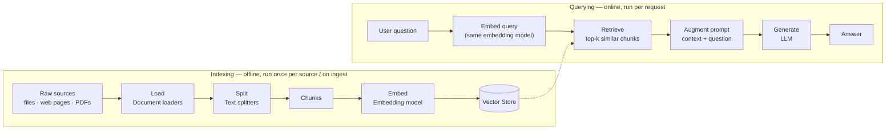
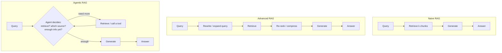
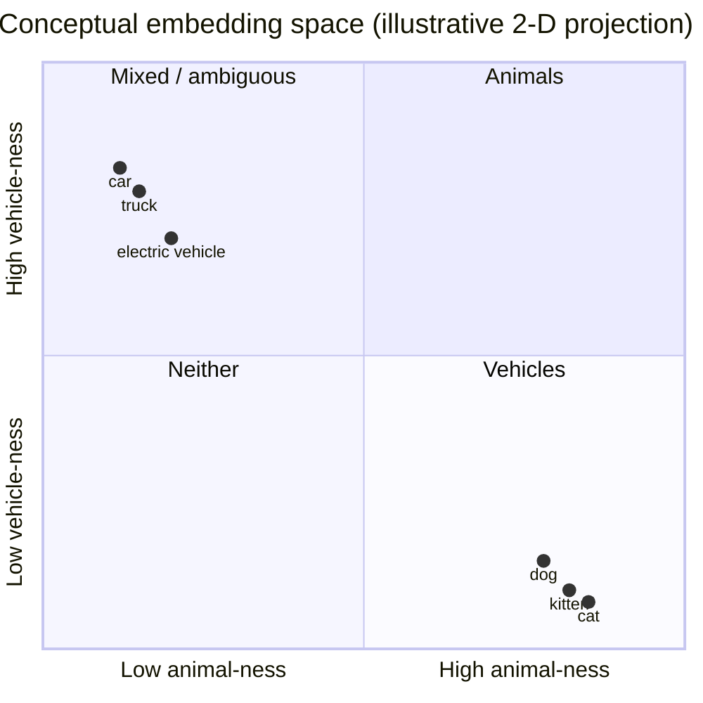
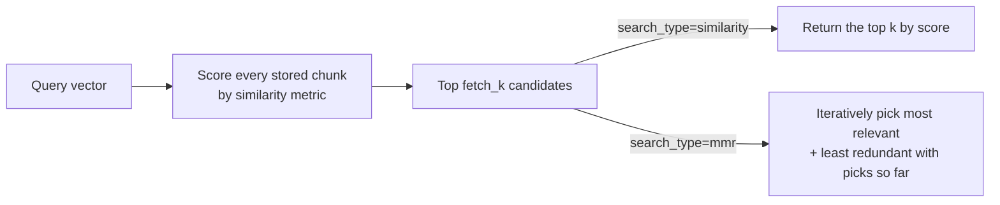
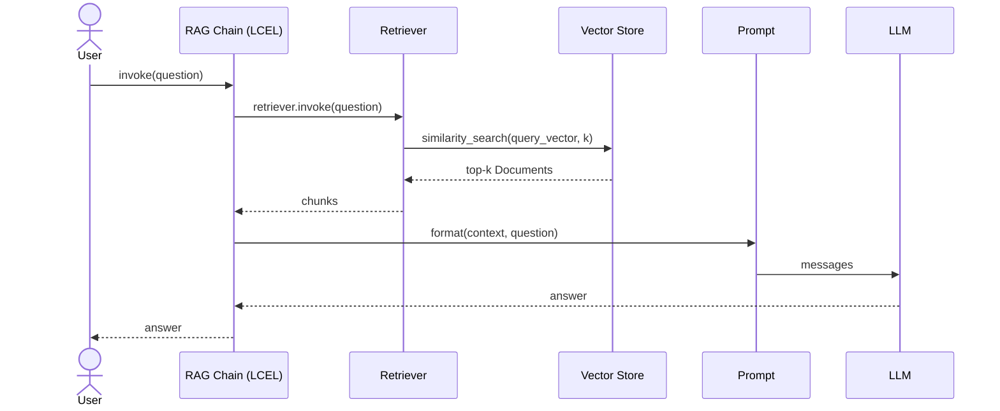
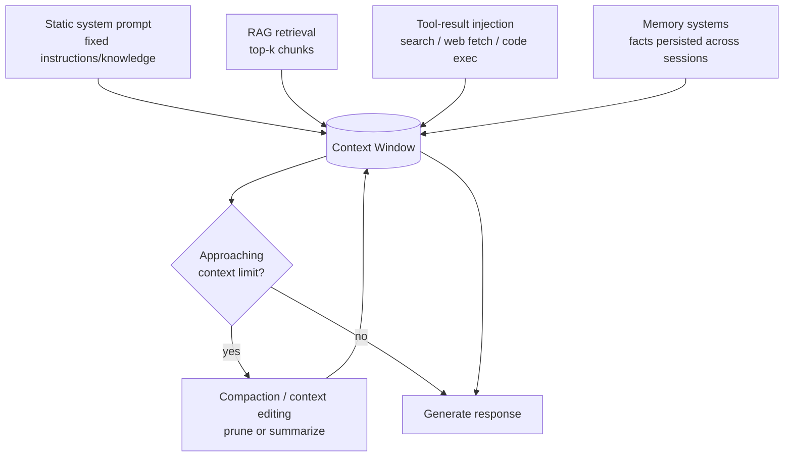
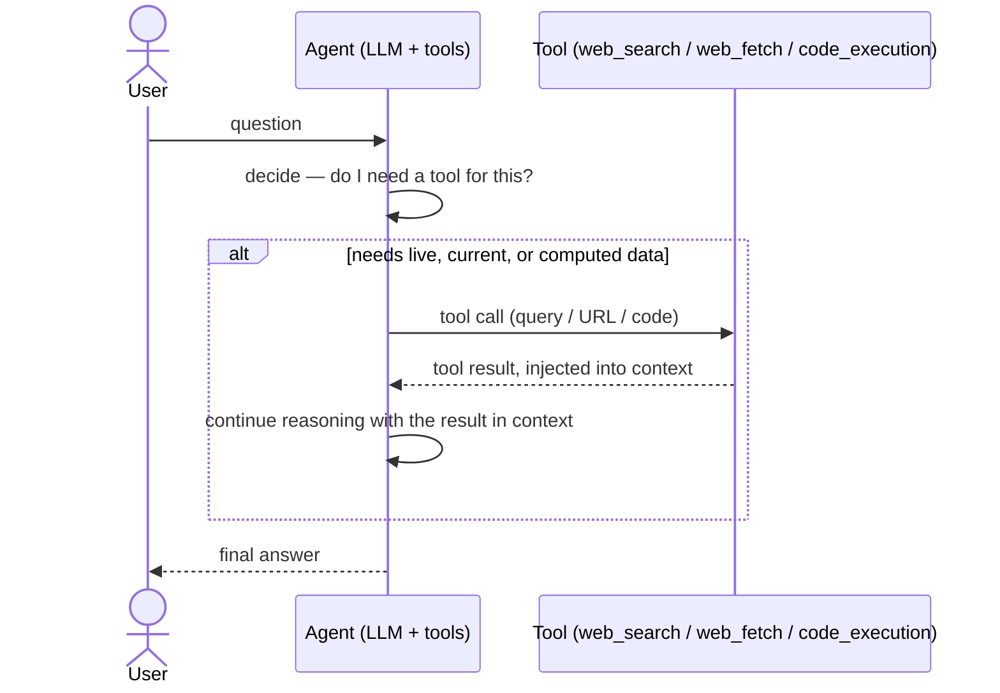
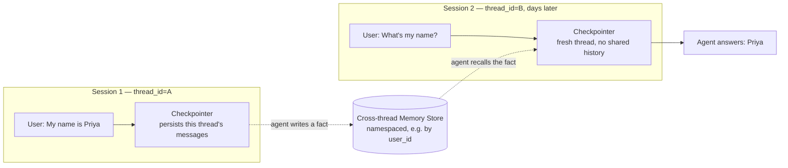
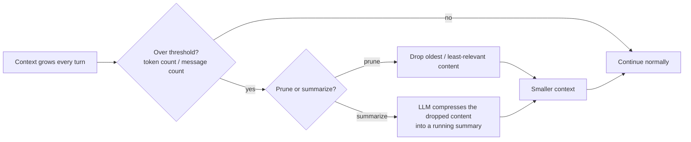

# Retrieval-Augmented Generation (RAG)

**RAG** is the practical endpoint of the context-engineering pipeline: [loading](Context_Engineering.md#document-loaders) documents and [splitting](Context_Engineering.md#text-splitters) them into good [chunks](Context_Engineering.md#chunking-strategy-size-and-overlap) exists specifically so those chunks can be embedded, indexed, and pulled back out at query time to ground an LLM's answer in real, current, external data — instead of the model answering from whatever it happens to remember from training (see [Why LLMs Hallucinate](LLM.md) and [Contextual Grounding](Prompt_Engineering.md#7-contextual-grounding-retrieval-augmented-prompting)).

RAG is also the best-known example of a broader idea: **context engineering isn't only retrieval.** Everything an LLM answers with — a fixed system prompt, a live tool call, a fact remembered from last week's conversation, a summary of an earlier part of this one — is context someone had to decide to put there. This doc covers RAG in depth (what it is, the different architectures it comes in, and the vectors/embeddings that power it), then walks through the other three techniques that fill an LLM's context window alongside it: [static system prompts](#static-system-prompts), [tool-result injection](#tool-result-injection), [memory systems](#memory-systems), and [compaction and context editing](#compaction-and-context-editing).

This is a conceptual companion doc rather than a single runnable script — it explains the additional stages (embed → store → retrieve → augment → generate) that pick up where [Context_Engineering.md](Context_Engineering.md) leaves off. The closest runnable illustration in this repo is [runnable_passthrough_context.py](../src/context_engineering/runnable_passthrough_context.py), which builds the same shape of chain — inject retrieved context, then prompt — using a stub `fake_retriever()` in place of a real vector store; the LCEL wiring shown there (`RunnablePassthrough.assign(context=...)`) carries over directly once the stub is swapped for a real retriever.

## Table of Contents

- [What Is RAG](#what-is-rag)
- [The RAG Pipeline](#the-rag-pipeline)
- [Types of RAG](#types-of-rag)
- [Vectors and Embeddings](#vectors-and-embeddings)
  - [What is a vector embedding](#what-is-a-vector-embedding)
  - [Similarity metrics](#similarity-metrics)
  - [Dense vs. sparse embeddings](#dense-vs-sparse-embeddings)
  - [Dimensionality and truncation](#dimensionality-and-truncation)
- [OpenAI Embeddings](#openai-embeddings)
- [Free and Cheap Embedding Models](#free-and-cheap-embedding-models)
- [Vector Stores](#vector-stores)
- [Retrievers](#retrievers)
  - [Similarity search](#similarity-search)
  - [Maximal Marginal Relevance (MMR)](#maximal-marginal-relevance-mmr)
  - [Metadata filtering](#metadata-filtering)
- [Building a RAG Chain with LCEL](#building-a-rag-chain-with-lcel)
- [Beyond RAG: Other Context-Engineering Techniques](#beyond-rag-other-context-engineering-techniques)
  - [Static system prompts](#static-system-prompts)
  - [Tool-result injection](#tool-result-injection)
  - [Memory systems](#memory-systems)
  - [Compaction and context editing](#compaction-and-context-editing)
- [RAG vs. Fine-Tuning](#rag-vs-fine-tuning)
- [Evaluating RAG Quality](#evaluating-rag-quality)
- [Common Pitfalls](#common-pitfalls)

## What Is RAG

Retrieval-Augmented Generation combines two things that are individually weak on their own:

- An LLM, which is fluent but only "knows" what was in its training data (frozen at a cutoff date, and never contains your private documents).
- A retriever, which can find precise, current, relevant information but can't reason about or summarize it in natural language.

RAG glues them together: at query time, relevant chunks are retrieved from an external knowledge source and inserted into the prompt as context, so the model generates its answer *from that context* rather than from memory alone. This is the retrieval-augmented variant of [contextual grounding](Prompt_Engineering.md#7-contextual-grounding-retrieval-augmented-prompting) — RAG is what automates finding the right context to ground with, instead of a human pasting it in by hand.

## The RAG Pipeline

RAG extends the loading/splitting pipeline from [Context_Engineering.md](Context_Engineering.md#what-is-context-engineering) with an offline **indexing** half and an online **querying** half:



1. **Embed** — an embedding model converts each chunk's text into a numeric vector that captures its meaning, so semantically similar text ends up with mathematically close vectors.
2. **Store** — a vector store indexes those vectors (and the chunk text/metadata alongside them) for fast nearest-neighbor lookup.
3. **Retrieve** — given a user's query, the retriever embeds the query the same way and returns the `k` most similar chunks from the store.
4. **Augment** — the retrieved chunks are formatted and inserted into a prompt template as context, alongside the original question.
5. **Generate** — the model produces its answer from the augmented prompt, grounded in the retrieved text rather than training-time recall alone.

The important structural point in the diagram: **indexing happens once (or whenever a source changes)**, while **querying happens on every request** — you never re-load, re-split, or re-embed the whole corpus just to answer one question.

## Types of RAG

"RAG" isn't one fixed architecture — it's a spectrum from a single retrieve-then-generate call up to a full agent that decides for itself how and when to retrieve:



- **Naive RAG** — embed the query, retrieve the top-`k` chunks, stuff them into the prompt, generate once. The baseline everything else improves on. Good enough for small, homogeneous corpora and simple factual Q&A; brittle when the query's wording doesn't overlap semantically with how the answer is phrased in the source text, and has no way to recover from a bad retrieval.
- **Advanced RAG** — adds a pre-retrieval step (query rewriting/expansion, or [HyDE](#what-is-a-vector-embedding) below) and/or a post-retrieval step (re-ranking retrieved chunks with a cross-encoder, or compressing them to just the relevant sentences) around the same retrieve-then-generate core. Reach for this once naive RAG's *retrieval* — not generation — is clearly the bottleneck. Costs extra LLM/re-ranker calls per query.
- **Modular RAG** — treats retrieval, routing, re-ranking, and generation as swappable, independently-evolvable pieces, and can route a single query to different retrievers or sources (a vector store for docs, a SQL tool for structured data, a web-search tool for anything not indexed). The right shape once a system has more than one kind of knowledge source. More orchestration to build and test.
- **Corrective RAG (CRAG)** — a lightweight evaluator scores each retrieved chunk for relevance; low-confidence retrievals trigger a fallback (typically live web search) instead of being handed to the generator as-is. Useful when your index is incomplete or stale and a fallback source exists. Adds an evaluation step and, on fallback, extra latency.
- **Self-RAG** — the model decides *whether* a given query needs retrieval at all (not every question does), and critiques its own retrieved evidence and its own draft answer before finalizing, rather than blindly trusting whatever came back. Best for mixed workloads where forcing retrieval on every query wastes latency, and where answer faithfulness matters enough to justify the extra reflection step(s).
- **HyDE (Hypothetical Document Embeddings)** — instead of embedding the raw (often short, vague) user query, first ask the LLM to write a *hypothetical* answer, then embed and search with *that* — a plausible answer's phrasing is usually much closer to how the real answer is written in the source corpus than a terse question is. Helps most when queries are short or ambiguous and naive-query retrieval recall is poor. Costs one extra LLM call before retrieval even starts.
- **Graph RAG** — indexes a knowledge graph (entities and their relationships) alongside or instead of a vector store, so retrieval can traverse relationships ("who reports to X", "what depends on Y") rather than only finding text that's semantically similar. Worth the extra build cost when the domain is relationship-heavy and multi-hop questions are common (org charts, supply chains, citation graphs); building and maintaining a graph is significantly more work than chunking and embedding text.
- **Agentic RAG** — wraps retrieval inside the [ReAct pattern](Prompt_Engineering.md#react-reasoning--acting-pattern): an agent with tool access decides iteratively whether to retrieve, from which source, and whether it has enough information yet, only generating once it judges the evidence sufficient. The right choice for multi-hop questions or multiple heterogeneous sources where the right query isn't known until after seeing initial results. Highest latency/cost of the group, and needs an iteration cap to avoid a runaway retrieval loop — see the `max_continuations` guidance in the agent-loop material this repo's [ReAct_Pattern.py](../src/prompt_engineering/patterns/ReAct_Pattern.py) demonstrates.

| Type | Adds on top of Naive RAG | Reach for it when |
| --- | --- | --- |
| Naive RAG | — | Baseline; simple, homogeneous corpus |
| Advanced RAG | Query rewrite + re-rank/compress | Retrieval quality is the bottleneck |
| Modular RAG | Routing across multiple sources | More than one kind of knowledge source |
| Corrective RAG | Relevance check + fallback source | Index is incomplete/stale, fallback exists |
| Self-RAG | Retrieve-or-not + self-critique | Mixed workload; faithfulness matters |
| HyDE | Hypothetical-answer query rewrite | Queries are short/ambiguous |
| Graph RAG | Relationship traversal | Multi-hop, relationship-heavy domain |
| Agentic RAG | Full iterative retrieve/evaluate loop | Multi-hop + multiple sources + unclear query upfront |

## Vectors and Embeddings

### What is a vector embedding

An embedding model maps a piece of text (a word, a sentence, a chunk) to a fixed-length array of floating-point numbers — a **vector** — that represents its meaning as a point in a high-dimensional space. The model is trained so that text with similar meaning ends up at nearby points, and unrelated text ends up far apart — the same idea behind the classic distributional-hypothesis observation that words appearing in similar contexts tend to have similar meaning.

The following is an illustrative, simplified 2-D projection of that idea — real embeddings have hundreds or thousands of dimensions, and a 2-D picture can only ever approximate what's really an N-dimensional relationship — but the clustering behavior it shows (animal words near each other, vehicle words near each other, the two groups far apart) is exactly what makes similarity search work:



### Similarity metrics

Retrieval is a nearest-neighbor search over this space: embed the query, then find which stored vectors are "closest" to it. "Closest" has three common definitions:

| Metric | Idea | Range | Notes |
| --- | --- | --- | --- |
| Cosine similarity | Angle between two vectors, ignoring their length | −1 to 1 (1 = identical direction) | Most common default; robust to differences in text length since it ignores magnitude |
| Dot product | Sum of element-wise products | Unbounded | Equivalent to cosine similarity if vectors are pre-normalized to unit length — faster to compute, so many stores normalize on insert and use this |
| Euclidean (L2) distance | Straight-line distance between two points | 0 to ∞ (0 = identical) | A *distance*, not a similarity — smaller is better, the opposite direction of the other two |

Which metric a given vector store uses by default varies by implementation; the important operational rule is to use the **same** metric a store's index was built with, and to check whether it expects normalized vectors.

A concrete, tiny example — computing cosine similarity by hand for two 4-dimensional toy vectors (real embeddings are hundreds to thousands of dimensions; this is only to make the formula concrete):

```python
import numpy as np

def cosine_similarity(a: np.ndarray, b: np.ndarray) -> float:
    return float(np.dot(a, b) / (np.linalg.norm(a) * np.linalg.norm(b)))

cat = np.array([0.9, 0.1, 0.4, 0.2])
kitten = np.array([0.85, 0.15, 0.35, 0.25])
car = np.array([0.1, 0.9, 0.2, 0.8])

print(cosine_similarity(cat, kitten))  # high — close in meaning
print(cosine_similarity(cat, car))     # low — unrelated
```

### Dense vs. sparse embeddings

- **Dense embeddings** — what "embeddings" usually means: every dimension of the vector has a non-zero value, produced by a neural network trained to capture meaning. Handles synonyms and paraphrasing well ("automobile" retrieves text about "car"), which is why it's the default choice for semantic search over prose.
- **Sparse embeddings** — a much older idea (TF-IDF, or its modern successor BM25): a vector with one dimension per vocabulary term, mostly zeros, where non-zero values weight how much a term matters to a document. No training required, cheap to compute, and — crucially — excellent at exact keyword/term matching (product SKUs, error codes, proper nouns) that dense embeddings can blur together.
- **Hybrid search** — combine both: run a dense similarity search and a sparse (BM25) keyword search in parallel, then merge/re-rank the results. Common in production RAG systems because it gets dense retrieval's semantic recall *and* sparse retrieval's precision on exact terms neither one reliably gets alone.

### Dimensionality and truncation

More dimensions can capture more nuance, but cost proportionally more storage and compute per comparison. Several modern embedding models (OpenAI's `text-embedding-3-*` family, Google's `gemini-embedding-001`) are trained to support **truncation** — you can safely shorten the vector to fewer dimensions and it degrades gracefully instead of breaking, because earlier dimensions are trained to carry more of the signal (the "Matryoshka" representation idea, named for nesting dolls). This is exposed as a `dimensions` parameter at embedding time rather than something you should just slice off the raw output afterward — see [OpenAI Embeddings](#openai-embeddings) below for the concrete numbers.

## OpenAI Embeddings

OpenAI's current embedding models, matching the pricing already tracked in [docs/LLM.md § Text Embedding Models](LLM.md#text-embedding-models):

| Model | Default dimensions | Truncatable via `dimensions` | Max input | Price (per 1M tokens) |
| --- | --- | --- | --- | --- |
| `text-embedding-3-small` | 1536 | Yes | 8,192 tokens | $0.02 |
| `text-embedding-3-large` | 3072 | Yes | 8,192 tokens | $0.13 |
| `text-embedding-ada-002` (legacy) | 1536 | No | 8,192 tokens | $0.10 |

`text-embedding-3-large` shortened to 256 dimensions with the `dimensions` parameter can still outperform the full 1536-dimension `ada-002` — so on the current generation of models, truncating a large model is often a better cost/quality tradeoff than reaching for the small model at full size. Prefer requesting the shorter vector via `dimensions` at embed time over manually slicing the returned vector after the fact — model providers document that the *training* accounts for this truncation, so a manual slice of an un-truncated call isn't guaranteed to behave the same.

```python
from langchain_openai import OpenAIEmbeddings

embeddings = OpenAIEmbeddings(model="text-embedding-3-small")
# or, truncated to a smaller vector for a storage-constrained vector store:
embeddings = OpenAIEmbeddings(model="text-embedding-3-large", dimensions=1024)

query_vector = embeddings.embed_query("What is LCEL?")
chunk_vectors = embeddings.embed_documents([c.page_content for c in chunks])
```

`embed_query` embeds a single string (for the incoming question); `embed_documents` batches many strings at once (for indexing a corpus of chunks) — use the batched form when embedding a corpus rather than calling `embed_query` in a loop.

## Free and Cheap Embedding Models

This repo's canonical, kept-current comparison lives in [docs/LLM.md § Text Embedding Models](LLM.md#text-embedding-models) — check there first. The highlights, plus two more free options worth calling out specifically for RAG:

| Model | Provider | Cost | Dimensions | Notes |
| --- | --- | --- | --- | --- |
| `sentence-transformers/all-MiniLM-L6-v2` | HuggingFace (local) | Free | 384 | Small and fast; the standard lightweight default |
| `sentence-transformers/all-mpnet-base-v2` | HuggingFace (local) | Free | 768 | Higher quality than MiniLM, ~5x slower — best accuracy-to-resource ratio among general-purpose local models |
| `multi-qa-mpnet-base-cos-v1` | HuggingFace (local) | Free | 768 | Trained specifically on 215M question/answer pairs — tuned for exactly the query-vs-passage retrieval RAG needs |
| `BAAI/bge-small-en-v1.5` | HuggingFace (local) | Free | 384 | Modern, competitive small model; a strong alternative to MiniLM at the same size |
| `gemini-embedding-001` | Google (API) | Free tier | 3072 (configurable: 768/1536/3072) | Needs an API key and network access, but no per-token cost on the free tier |

Running a model **locally** (any `sentence-transformers/*` or `BAAI/*` model above) means zero marginal cost per embedding, no rate limits, no data leaving your machine, and it works offline after the first download — the tradeoff is needing enough local CPU/RAM (or a GPU for larger corpora) and generally lower ceiling quality than the current top proprietary API models (OpenAI `text-embedding-3-large`, Google `gemini-embedding-001`).

```python
from langchain_huggingface import HuggingFaceEmbeddings

embeddings = HuggingFaceEmbeddings(model_name="sentence-transformers/all-MiniLM-L6-v2")
# first call downloads the model weights locally; subsequent calls run offline
vector = embeddings.embed_query("What is LCEL?")
```

Embedding-model rankings shift as new open models are released — for the current state of the art beyond what's listed here, check the [MTEB (Massive Text Embedding Benchmark) leaderboard](https://huggingface.co/spaces/mteb/leaderboard), filtered to the retrieval task and a size you can run. As the leaderboard's own documentation cautions: a model that ranks well overall doesn't necessarily perform best on *your* corpus — worth validating a couple of promising candidates against your own data before committing.

## Vector Stores

A vector store persists embedded chunks and answers "which of these vectors are closest to this query vector?" efficiently, without a brute-force scan.

`langchain_core.vectorstores.InMemoryVectorStore` ships in LangChain core with no extra dependency and is the simplest way to get started — good for examples, tests, and small corpora. It builds directly on the chunking output from [chunking_splitters.py](../src/context_engineering/loaders_chunking/chunking_splitters.py):

```python
from langchain_core.vectorstores import InMemoryVectorStore
from langchain_text_splitters import RecursiveCharacterTextSplitter

from loaders import load_pdf

documents = load_pdf(pdf_path)
chunks = RecursiveCharacterTextSplitter(chunk_size=500, chunk_overlap=50).split_documents(documents)

vector_store = InMemoryVectorStore(embeddings)
vector_store.add_documents(chunks)
```

For anything beyond a toy corpus — larger datasets, persistence across process restarts, approximate nearest-neighbor indexing for speed at scale — swap in a dedicated vector store integration (e.g. Chroma, FAISS, Pinecone, or a Postgres/pgvector-backed store) behind the same `VectorStore` interface; the rest of the pipeline below doesn't change.

## Retrievers

A `VectorStore` becomes a `Retriever` — a `Runnable` that plugs straight into an LCEL chain — via `.as_retriever(...)`:

```python
retriever = vector_store.as_retriever(search_kwargs={"k": 4})
retriever.invoke("What is LCEL?")  # -> list[Document], most similar first
```



### Similarity search

The default search type. Returns the `k` chunks whose embeddings are closest to the query embedding. Simple and usually the right starting point.

### Maximal Marginal Relevance (MMR)

Plain similarity search can return `k` near-duplicate chunks that all say the same thing. MMR re-ranks candidates to balance relevance against diversity, so the retrieved set covers more distinct information:

```python
retriever = vector_store.as_retriever(
    search_type="mmr",
    search_kwargs={"k": 4, "fetch_k": 20, "lambda_mult": 0.5},
)
```

`fetch_k` candidates are pulled by similarity first, then MMR selects `k` of them; `lambda_mult` trades off relevance (1.0) against diversity (0.0).

### Metadata filtering

Because [document loaders](Context_Engineering.md#document-loaders) attach `metadata` (source path, page number, header hierarchy, ...) that [splitting carries forward onto every chunk](Context_Engineering.md#splitting-pdfs-and-other-documents), retrieval can be scoped before similarity search even runs — e.g. restrict to one source file or one PDF page range:

```python
retriever = vector_store.as_retriever(
    search_kwargs={"k": 4, "filter": lambda doc: doc.metadata.get("source") == "handbook.pdf"},
)
```

The exact filter syntax (a callable vs. a provider-specific query dict) varies by vector store implementation — check the integration's docs.

## Building a RAG Chain with LCEL

Wiring retrieval into generation is just another [LCEL](LCEL.md) composition — retrieve, format the chunks into a context string, fill the prompt, call the model, parse the output:



```python
from langchain_core.documents import Document
from langchain_core.output_parsers import StrOutputParser
from langchain_core.prompts import ChatPromptTemplate
from langchain_core.runnables import RunnablePassthrough

def format_docs(docs: list[Document]) -> str:
    return "\n\n".join(doc.page_content for doc in docs)

prompt = ChatPromptTemplate.from_template(
    "Answer the question using only the context below. "
    "If the context doesn't contain the answer, say you don't know.\n\n"
    "Context:\n{context}\n\nQuestion: {question}"
)

rag_chain = (
    {"context": retriever | format_docs, "question": RunnablePassthrough()}
    | prompt
    | model
    | StrOutputParser()
)

rag_chain.invoke("What is LCEL?")
```

This is the same `RunnablePassthrough` pattern demonstrated with a stub retriever in [runnable_passthrough_context.py](../src/context_engineering/runnable_passthrough_context.py) — there, `RunnablePassthrough.assign(context=fake_retriever)` keeps the original `question` key while adding a computed `context` key for the prompt. Swap `fake_retriever` for `retriever | format_docs` and the fake facts dictionary for a real vector store, and it's the same chain.

Instructing the prompt to answer *only* from the provided context (and to admit when it doesn't know) is what actually delivers the grounding benefit — without that instruction, the model may blend retrieved context with training-time recall and produce answers that look grounded but aren't.

## Beyond RAG: Other Context-Engineering Techniques

RAG is one of several ways to control what ends up in an LLM's context window on a given turn. The other three fill it with content that isn't necessarily pulled from a pre-built vector index — a fixed instruction set, a live tool call, or something the system remembers about a prior session — and, once the window starts filling up, something has to decide what to trim:



### Static system prompts

The simplest and cheapest context-injection technique: bake fixed instructions, persona, formatting rules, or a small amount of static reference knowledge directly into the system prompt once, rather than retrieving or computing it per request.

It's the right tool when the content is **small, fixed, and needed on every request** — a persona, a house style guide, output-format rules, a short set of business constraints. It's the wrong tool once the content is **large or changes often** — that's exactly the gap RAG (for large/changing external knowledge) and [tool-result injection](#tool-result-injection) (for live/computed data) fill instead:

| Put it in the system prompt when... | Retrieve or inject it instead when... |
| --- | --- |
| It's small and rarely changes | It's a large corpus, or changes frequently |
| It's needed on *every* request | It's only relevant to *some* requests |
| Always including it is cheap | Always including it would be expensive/wasteful |

Because the system prompt is identical across many requests, most providers cache the stable prefix of a prompt for a latency/cost win — one more reason to keep it frozen and deterministic (no timestamps, no per-user interpolation baked into the system prompt itself) rather than rebuilding it on every call.

This doc covers *what belongs* in the system prompt versus what belongs in retrieved/injected context; the companion concern — keeping a system prompt from being overridden by untrusted input in a user message or a retrieved document — is covered in [Prompt_Engineering.md § System Prompts & Injection-Resistant Design](Prompt_Engineering.md#system-prompts--injection-resistant-design), demonstrated in [SystemPrompt_Pattern.py](../src/prompt_engineering/patterns/SystemPrompt_Pattern.py).

### Tool-result injection

RAG retrieves from a corpus you indexed *in advance*. Tool-result injection is the just-in-time alternative: the agent calls a tool (web search, a web-page fetch, code execution, a database or API query) at request time, and the tool's **result** is appended to the conversation as if it were retrieved context — the model then continues generating with that result in view.



| | Pre-indexed retrieval (RAG) | Tool-result injection |
| --- | --- | --- |
| When data is fetched | In advance, at index time | At request time, live |
| Freshness | As fresh as the last re-index | Always current |
| Per-query cost | Cheap (one similarity search) | An extra round trip per tool call |
| Needs pre-processing | Yes — load, split, embed, index | No — nothing to index ahead of time |
| Depends on | Index quality and recency | The model correctly deciding *when* to call the tool |

This is the mechanism behind the [ReAct pattern](Prompt_Engineering.md#react-reasoning--acting-pattern) and this repo's tool-using agents — see [calc_tool_agent.py](../src/agent-tools/calc_tool_agent.py) and [web_search_tool_agent.py](../src/agent-tools/web_search_tool_agent.py) for runnable examples of a `tool_use` request producing a result that gets appended back into the message list before the model continues.

Tool results consume context exactly like retrieved chunks do — a large scraped web page or a big `stdout` dump from code execution can blow through a context budget just as easily as too many retrieved chunks can. Summarize or truncate large tool outputs before appending them (or keep only a pointer/summary in context with the full result available on demand) rather than injecting them verbatim by default.

### Memory systems

"Memory" is about **persisting and recalling information across sessions** — distinct from RAG (retrieval from a pre-built corpus of *documents*) in that what's being retrieved is usually facts the *system itself* wrote down earlier, about this specific user or conversation. It comes in two scopes:

**Short-term (thread-scoped) memory** — remembering earlier turns *within* one ongoing conversation. This repo already covers this in depth as Buffer/Window/Summary memory in [Prompt_Engineering.md § Conversation Memory Patterns](Prompt_Engineering.md#conversation-memory-patterns), backed by a LangGraph checkpointer (`InMemorySaver`) keyed by `thread_id` — see [state_memory.py](../src/context_engineering/state_memory.py) and [Memory_Pattern.py](../src/context_engineering/Memory_Pattern.py) for runnable examples. `InMemorySaver` is in-process only, so this history doesn't survive a restart — swapping in a durable checkpointer backend (e.g. a SQLite- or Postgres-backed one) makes the *same* thread's history durable across restarts, while still being scoped to that one `thread_id`.

**Long-term (cross-thread) memory** — recalling facts in a session that has *no shared history* with the session that learned them (a returning user, a new conversation, days later). Thread-scoped checkpointers can't do this by construction — they're keyed by `thread_id`, and a new conversation gets a new one. LangGraph's `Store` interface fills this gap: a namespaced key-value store that any thread can read from and write to, independent of `thread_id`.



```python
from langgraph.store.memory import InMemoryStore

store = InMemoryStore()

# write — namespace is a tuple, e.g. (user_id, "memories"); key is unique within it
store.put(("user_123", "memories"), "pref_1", {"food_preference": "pizza"})

# exact-key read
item = store.get(("user_123", "memories"), "pref_1")

# list/search everything under a namespace prefix
items = store.search(("user_123", "memories"), limit=10)
```

`InMemoryStore` can also be configured with an embeddings index, turning key-value lookup into **semantic recall** — the store embeds each memory's content on write, so `search()` can take a natural-language `query` and return the most relevant memories by similarity instead of requiring an exact key. This is where memory and RAG converge conceptually: long-term memory is RAG over a small, agent-written knowledge base instead of a large static document corpus.

```python
from langchain.embeddings import init_embeddings
from langgraph.store.memory import InMemoryStore

store = InMemoryStore(
    index={
        "embed": init_embeddings("openai:text-embedding-3-small"),
        "dims": 1536,
        "fields": ["food_preference", "$"],  # which value fields to embed ("$" = whole value)
    }
)

results = store.search(("user_123", "memories"), query="What does the user like to eat?", limit=3)
```

A practical guardrail: write to long-term memory **deliberately** — have the agent decide what's worth remembering (e.g. via an explicit "remember this" tool call) rather than dumping every message into the store. An unbounded, noisy memory store degrades semantic recall the same way an unbounded [Buffer memory](Prompt_Engineering.md#conversation-memory-patterns) degrades a context window — more isn't better once irrelevant entries start out-competing relevant ones in similarity search. And as with any persisted store: never write secrets, API keys, or credentials into memory — they'll be replayed back into every future session that recalls them.

### Compaction and context editing

Every technique above adds content to the context window; compaction is what happens once that window starts running out of room. It generalizes the [Buffer/Window/Summary conversation-memory patterns](Prompt_Engineering.md#conversation-memory-patterns) already documented in this repo from "chat messages specifically" to **anything** occupying the window — old tool results, previously retrieved RAG chunks that are no longer relevant to the current turn, earlier reasoning, or old messages:



- **Pruning / editing** — remove stale content outright once it's no longer needed (drop an old tool result after its conclusion has already been folded into the conversation; drop retrieved chunks from three turns ago that answered a different question). Cheap, but the content is genuinely gone — this is exactly what [Window memory](Prompt_Engineering.md#conversation-memory-patterns) does at message-scope, generalized to every kind of context content.
- **Compaction / summarization** — instead of deleting stale content, replace it with an LLM-generated summary, so the gist survives in compressed form even though the verbatim text doesn't. This is [Summary memory](Prompt_Engineering.md#conversation-memory-patterns) generalized the same way — this repo's [`SummarizationMiddleware` example in `Memory_Pattern.py`](../src/context_engineering/Memory_Pattern.py) is a concrete, runnable instance of the "summarize" branch above, and its `windowed_history` middleware (built on `trim_messages`) is a concrete instance of the "prune" branch.

The reason this matters beyond chat history specifically: a long agentic session accumulates tool results and retrieved chunks just as fast as it accumulates messages, and those are usually the first candidates worth pruning or compacting, since a tool result or a retrieved chunk is often only load-bearing for the turn that requested it — unlike a fact the user stated about themselves, which is exactly the kind of thing worth promoting into [long-term memory](#memory-systems) instead of letting it get silently pruned away.

### Summary: five techniques, one context window

| Technique | Source of content | Freshness | Update cost | Scope |
| --- | --- | --- | --- | --- |
| Static system prompt | Written once, by you | Never changes (until you edit it) | Manual edit | Every request |
| RAG | Pre-indexed corpus | As fresh as the last re-index | Re-embed + re-index | Whichever chunks match the query |
| Tool-result injection | Live call at request time | Always current | None — no index to maintain | Only when the model decides to call a tool |
| Memory systems | Facts the system wrote down earlier | As current as the last write | Cheap — one `put()` | This user / this cross-session scope |
| Compaction / context editing | N/A — trims/compresses the other four | N/A | N/A | Whatever's already in the window |

## RAG vs. Fine-Tuning

Both let a model "know" things beyond its base training, but they solve different problems:

| | RAG | Fine-tuning |
| --- | --- | --- |
| Updates when source data changes | Immediately — re-index the changed documents | Requires re-training |
| Adds new facts/knowledge | Yes — this is its main use case | Poorly suited; models often fail to reliably recall fine-tuned facts |
| Changes model *behavior* (tone, format, task-specific skill) | No | Yes |
| Cost to update | Cheap (re-embed + re-index) | Expensive (training run) |
| Answer traceability | High — you can show which chunks were retrieved | Low — no visibility into which training example produced a behavior |

They're complementary, not exclusive: fine-tune to change how a model behaves or follows format instructions, use RAG so it can cite current, private, or frequently-changing facts.

## Evaluating RAG Quality

RAG failures split into two categories, and it's worth diagnosing which one you're seeing before changing anything:

- **Retrieval failures** — the right chunk was never fetched. Symptoms: the answer is wrong or "I don't know" even though the source document contains the fact. Fixes to try first: `chunk_size`/`chunk_overlap` tuning (see [Chunking: Strategy, Size, and Overlap](Context_Engineering.md#chunking-strategy-size-and-overlap)), a higher `k`, MMR instead of plain similarity search, hybrid (dense + sparse) search, or a better embedding model.
- **Generation failures** — the right chunk was retrieved, but the model didn't use it correctly (ignored it, contradicted it, or hallucinated on top of it). Fixes to try first: a stricter prompt instruction (answer *only* from context), a smaller `k` so irrelevant chunks don't crowd out the relevant one, or [Chain-of-Thought](Prompt_Engineering.md#chain-of-thought-cot-pattern) to make the model reason over the context explicitly before answering.

A quick manual check that separates the two: print the retrieved chunks (`retriever.invoke(question)`) before generation. If the answer isn't in there, it's a retrieval failure; if it is, it's a generation failure.

## Common Pitfalls

- **Skipping `chunk_overlap`.** A chunk boundary that falls mid-sentence can retrieve a fact stripped of the context that makes it correct. See [Why `chunk_overlap` matters](Context_Engineering.md#why-chunk_overlap-matters).
- **Mismatched embedding models.** Embedding queries with a different model (or even a different model version) than was used to embed the stored chunks silently degrades similarity search — the vectors are no longer comparable.
- **`k` too small or too large.** Too small and the correct chunk may not make the cut; too large and irrelevant chunks dilute the context and can pull the model's answer off track.
- **No "I don't know" instruction.** Without an explicit prompt instruction to stick to the provided context, the model will happily fill gaps with training-time recall — producing answers that look grounded but silently aren't.
- **Re-indexing forgotten after a data or model change.** Both a change to the source documents and a change to the embedding model require re-embedding and re-indexing; stale vectors return stale or wrong chunks.
- **Injecting raw tool output without bounds.** A full scraped web page or an unbounded code-execution log appended verbatim can consume as much context as a bad chunking decision — summarize or truncate before injecting.
- **Letting long-term memory grow unbounded.** Writing every message to a cross-session memory store (instead of deliberately chosen facts) degrades semantic recall the same way an unbounded Buffer degrades a context window — see [Memory systems](#memory-systems).
- **Compacting away load-bearing detail.** A summary that's too aggressive can drop the one specific number or name a later turn needed — prefer keeping recent/high-signal content verbatim and only summarizing what's genuinely stale, per [Compaction and context editing](#compaction-and-context-editing).
