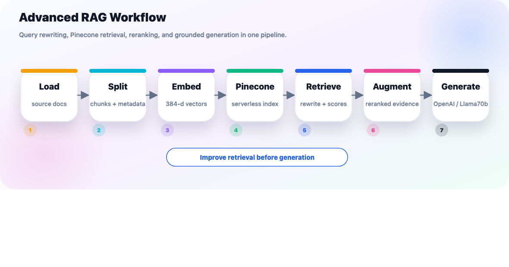
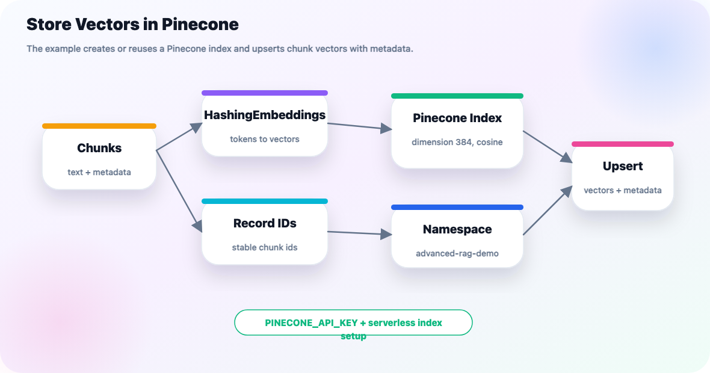
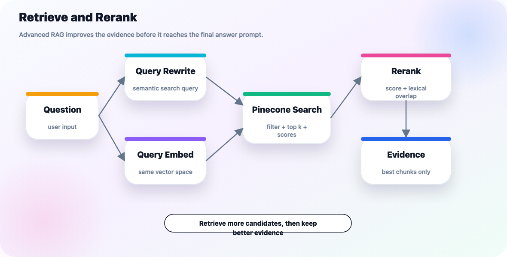

# Advanced RAG with Pinecone

Advanced RAG keeps the same seven-stage workflow as Basic RAG:

```text
load -> split -> embed -> store -> retrieve -> augment -> generate
```

The difference is that Advanced RAG adds retrieval-quality improvements around the basic pipeline:

- query rewriting before retrieval
- Pinecone as the vector database
- metadata filtering
- score-aware retrieval
- reranking before prompt augmentation
- explicit evidence formatting before generation

The runnable companion example is [advanced_rag.py](../../src/context_engineering/rags/advanced_rag.py).



## What You Will Build

The example answers a question from a local text file, stores vectors in Pinecone, retrieves candidate chunks, reranks them, and generates a grounded answer.

| Piece              | Choice                                                               |
| ------------------ | -------------------------------------------------------------------- |
| Source document    | [sample.txt](../../src/context_engineering/resources/sample.txt)      |
| Python example     | [advanced_rag.py](../../src/context_engineering/rags/advanced_rag.py) |
| VectorDB           | Pinecone serverless index                                            |
| Embeddings         | Transparent local`HashingEmbeddings` for tutorial visibility       |
| Retrieval upgrades | query rewrite, metadata filter, scores, reranking                    |
| LLM                | `llama70b` by default; `openai` also supported                   |

The embedding class is intentionally simple so the script can print how tokenization and vector creation work. In a production app, replace it with OpenAI, Gemini, Voyage, or another semantic embedding model and create the Pinecone index with that model's vector dimension.

## Setup

Install the Pinecone dependencies:

```bash
uv add pinecone langchain-pinecone
```

Add your Pinecone key to `.env`:

```bash
PINECONE_API_KEY=...
```

The example uses these defaults:

| Environment variable             | Default                       | Meaning                                        |
| -------------------------------- | ----------------------------- | ---------------------------------------------- |
| `ADVANCED_RAG_MODEL`           | `llama70b`                  | Final answer model; use`openai` if preferred |
| `ADVANCED_RAG_INDEX`           | `do-langchain-advanced-rag` | Pinecone index name                            |
| `ADVANCED_RAG_NAMESPACE`       | `advanced-rag-demo`         | Pinecone namespace for demo records            |
| `ADVANCED_RAG_PINECONE_CLOUD`  | `aws`                       | Pinecone serverless cloud                      |
| `ADVANCED_RAG_PINECONE_REGION` | `us-east-1`                 | Pinecone serverless region                     |
| `ADVANCED_RAG_VERBOSE`         | `1`                         | Print the detailed pipeline trace              |

## Run It

From the repo root:

```bash
uv run python src/context_engineering/rags/advanced_rag.py
```

From inside `src/context_engineering/rags/`:

```bash
uv run python advanced_rag.py
```

Use OpenAI for generation:

```bash
ADVANCED_RAG_MODEL=openai uv run python src/context_engineering/rags/advanced_rag.py
```

Ask a different question:

```bash
ADVANCED_RAG_QUESTION="What are document loaders?" uv run python src/context_engineering/rags/advanced_rag.py
```

Turn off the verbose tutorial trace:

```bash
ADVANCED_RAG_VERBOSE=0 uv run python src/context_engineering/rags/advanced_rag.py
```

## Stage 1: Load

Loading reads the local source file and wraps it in a LangChain `Document`:

```python
def load_documents(source_path: Path = DEFAULT_SOURCE_PATH) -> list[Document]:
    text = source_path.read_text(encoding="utf-8")
    return [
        Document(
            page_content=text,
            metadata={
                "source": str(source_path),
                "loader": "Path.read_text",
                "rag_type": "advanced",
            },
        )
    ]
```

The verbose trace prints:

```text
1. Load
Document 1: chars=598
Metadata: {...}
Preview: ...
```

## Stage 2: Split

The splitter breaks source text into smaller chunks and attaches stable chunk metadata:

```python
chunks = splitter.split_documents(documents)
for index, chunk in enumerate(chunks):
    chunk.metadata["chunk_index"] = index
    chunk.metadata["chunk_id"] = document_id(chunk, index)
```

Metadata matters more in Advanced RAG because it enables filtering, debugging, and citations.

## Stage 3: Embed

The example uses `HashingEmbeddings(dimensions=384)` so the index dimension is small and the token-to-vector process can be printed.

The verbose trace shows:

```text
3. Embed
Embedding model: transparent local HashingEmbeddings
Question token count: 6
Question first tokens: [...]
Question token -> vector bucket updates:
        'building' -> bucket=246 sign=+1
Question vector summary: dimensions=384, non_zero=6, first_non_zero=[...]
```

In real systems, the embedding model is the semantic search engine. The query and chunks must use the same embedding model and dimension.

## Stage 4: Store in Pinecone

The example creates or reuses a Pinecone serverless index:

```python
pc = Pinecone(api_key=api_key)

if not pc.has_index(index_name):
    pc.create_index(
        name=index_name,
        dimension=EMBEDDING_DIMENSIONS,
        metric="cosine",
        spec=ServerlessSpec(cloud=cloud, region=region),
    )
```

Then it stores chunks through LangChain's `PineconeVectorStore`:

```python
vector_store = PineconeVectorStore(
    index=pinecone_index,
    embedding=embeddings,
    namespace=namespace,
)
vector_store.add_documents(chunks, ids=ids)
```



The verbose trace prints the important write details:

```text
4a. Pinecone Index Setup
Index name: do-langchain-advanced-rag
Expected dimension: 384
Metric: cosine
Serverless cloud/region: aws/us-east-1

4b. Store in Pinecone
VectorDB: Pinecone
Namespace: advanced-rag-demo
Upsert records: 4
Pinecone record 1:
  id: advanced-rag-0-...
  text: ...
  metadata: {...}
  embedding: dimensions=384, non_zero=13, first_non_zero=[...]
```

The script deletes the same ids before upserting so repeated demo runs do not accumulate duplicate records.

## Stage 5: Retrieve

`retrieve()` is the single entry point for this stage — the "R" in RAG, expanded with Advanced RAG's production-style improvements. It wraps the three parts below (query rewrite, Pinecone retrieval, rerank) behind one call, so `advanced_rag()` doesn't have to wire them together itself:

```python
def retrieve(
    vector_store,
    question: str,
    *,
    model_name: str,
    k: int = 4,
    keep: int = 3,
    metadata_filter: dict[str, Any] | None = None,
    verbose: bool = True,
) -> dict[str, Any]:
    rewritten_query = rewrite_query(question, model_name=model_name, verbose=verbose)
    scored_documents = retrieve_documents(
        vector_store,
        rewritten_query,
        k=k,
        metadata_filter=metadata_filter,
    )

    if verbose:
        print_retrieval_debug(rewritten_query, scored_documents, metadata_filter)

    reranked_documents = rerank_documents(
        question,
        scored_documents,
        keep=keep,
        verbose=verbose,
    )

    return {
        "rewritten_query": rewritten_query,
        "scored_documents": scored_documents,
        "reranked_documents": reranked_documents,
    }
```

Advanced RAG improves retrieval in three parts, and each one below is a step inside `retrieve()`.

### 5a. Query Rewrite

The first LLM call rewrites the user question into a concise semantic search query:

```python
rewritten_query = rewrite_query(question, model_name=model_name)
```

If the rewrite call fails, the script uses a deterministic fallback that removes common stopwords.

### 5b. Pinecone Retrieval

The rewritten query is sent to Pinecone with a metadata filter:

```python
scored_documents = vector_store.similarity_search_with_score(
    rewritten_query,
    k=k,
    filter={"rag_type": "advanced"},
)
```

The verbose trace prints:

```text
5b. Retrieve from Pinecone
Query sent to Pinecone: langchain building blocks
Metadata filter: {'rag_type': 'advanced'}
Returned matches: 4
Pinecone match 1:
  score/distance: ...
  chunk_id: advanced-rag-...
  metadata: {...}
  text: ...
```

### 5c. Rerank

The script reranks retrieved chunks with a simple transparent score:

```python
combined_score = lexical_overlap - float(vector_score)
```

This is intentionally simple. Production systems often use a cross-encoder reranker or an LLM-based relevance grader. The point of the tutorial is to show where reranking fits in the pipeline.



This diagram is `retrieve()` end to end: Query Rewrite is `rewrite_query()`, Query Embed + Pinecone Search is `retrieve_documents()`, and Rerank is `rerank_documents()` — three function calls, one entry point.

## Stage 6: Augment

After reranking, only the best evidence is formatted into the prompt:

```python
context = format_documents(reranked_documents)
prompt = build_prompt()
```

The prompt tells the model to use only the evidence:

```python
"Use only the evidence below. If the evidence is insufficient, say you do not know."
```

The verbose trace prints:

```text
6. Augment
Question inserted into prompt: ...
Reranked evidence documents inserted: 3
Formatted context characters: ...
Formatted context preview:
...
Prompt message preview:
...
```

## Stage 7: Generate

Generation uses the configured model alias:

```python
model = get_model(model_name)
chain = prompt | model | StrOutputParser()
answer = chain.invoke({"context": context, "question": question})
```

Use:

```bash
ADVANCED_RAG_MODEL=llama70b uv run python src/context_engineering/rags/advanced_rag.py
ADVANCED_RAG_MODEL=openai uv run python src/context_engineering/rags/advanced_rag.py
```

The verbose trace prints:

```text
7. Generate
Requested model alias: llama70b
Resolved model: llama-3.3-70b-versatile
Input: augmented evidence prompt from step 6

Generated answer:
...
```

## What Makes This Advanced

| Feature                  | Basic RAG                                 | Advanced RAG                   |
| ------------------------ | ----------------------------------------- | ------------------------------ |
| Query used for retrieval | Raw user question                         | Rewritten search query         |
| VectorDB                 | In-memory or Chroma in the basic tutorial | Pinecone                       |
| Filtering                | Optional/simple                           | Metadata filter on`rag_type` |
| Retrieval output         | Top-`k` chunks                          | Top-`k` chunks with scores   |
| Post-processing          | None                                      | Reranking before generation    |
| Prompt context           | Retrieved chunks                          | Reranked evidence              |

## Common Issues

| Issue                            | Fix                                                                                           |
| -------------------------------- | --------------------------------------------------------------------------------------------- |
| `PINECONE_API_KEY is required` | Add`PINECONE_API_KEY` to `.env`                                                           |
| Pinecone package missing         | Run`uv add pinecone langchain-pinecone`                                                     |
| Index dimension mismatch         | Use a new index name or recreate the index with the embedding dimension                       |
| Region not supported             | Set`ADVANCED_RAG_PINECONE_REGION` to a serverless region available in your Pinecone project |
| Poor retrieval                   | Inspect stage 5 output before changing the LLM                                                |

## Next Experiments

- Replace `HashingEmbeddings` with `OpenAIEmbeddings`.
- Replace lexical reranking with a cross-encoder reranker.
- Increase corpus size and compare raw query vs rewritten query retrieval.
- Add citation formatting using the source/chunk metadata.
- Add a retrieval evaluator before generation.
