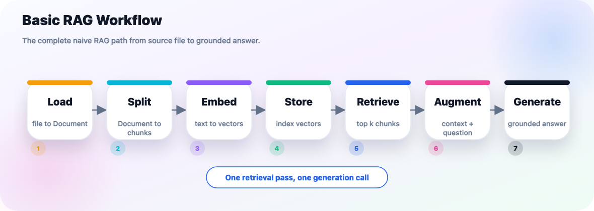
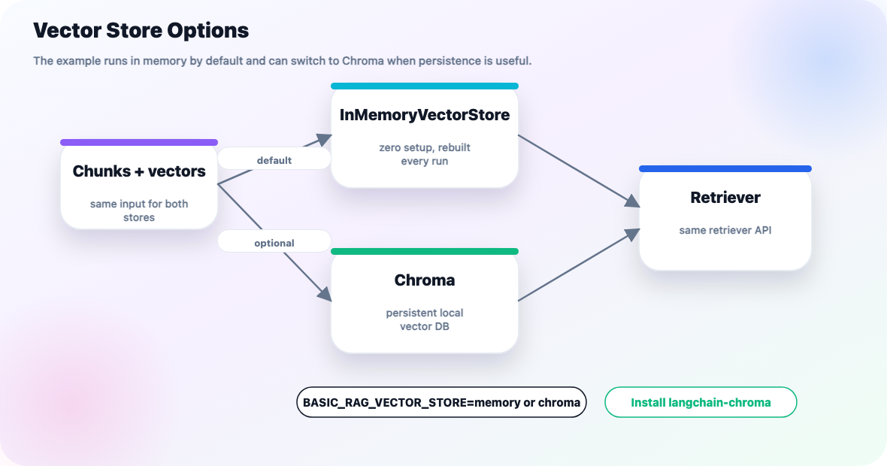
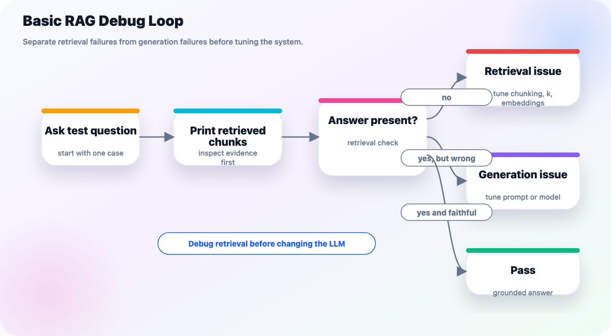

# Basic RAG (Naive RAG)

Basic RAG is the smallest useful Retrieval-Augmented Generation system:

```text
load -> split -> embed -> store -> retrieve -> augment -> generate
```



It is called "naive" because it does the direct version of RAG: retrieve the top matching chunks once, put them into the prompt, and generate one answer. There is no query rewriting, reranking, routing, graph traversal, or agent loop yet.

The runnable companion example is [basic_rag.py](../../src/context_engineering/rags/basic_rag.py).

## What You Will Build

The example answers a question from a local text file:

- Source document: [sample.txt](../../src/context_engineering/resources/sample.txt)
- Python example: [basic_rag.py](../../src/context_engineering/rags/basic_rag.py)
- Vector store: `InMemoryVectorStore` by default, with an optional Chroma mode
- Retriever: `vector_store.as_retriever(search_kwargs={"k": 3})`
- Generator: configured repo LLM using API keys from `.env`, with a deterministic local fallback if the call fails

The example intentionally uses a tiny local `HashingEmbeddings` class. That keeps the retrieval workflow runnable without downloading embedding models or needing an embeddings API key. It is good for learning the pipeline, not for production semantic search quality.

## Basic RAG Workflow

| Stage | Function in `basic_rag.py` | What it teaches |
| --- | --- | --- |
| Load | `load_documents()` | RAG starts with source text wrapped in `Document` objects |
| Split | `split_documents()` | Long documents become smaller retrievable chunks |
| Embed | `create_embeddings()` | Chunks and questions must use the same embedding model |
| Store | `create_vector_store()` | Vectors, text, and metadata are indexed together |
| Retrieve | `retrieve()` (wraps `create_retriever()` + `retrieve_documents()`) | The question pulls back the top matching chunks |
| Augment | `format_documents()` + `build_prompt()` | Retrieved text becomes prompt context |
| Generate | `generate_answer()` | The model answers from the retrieved context |

## Run It

From the repo root:

```bash
uv run python src/context_engineering/rags/basic_rag.py
```

Expected shape of the output:

```text
==============================================================================
1. Load
==============================================================================
Document 1: chars=598
Metadata: {...}
Preview: ...

==============================================================================
2. Split
==============================================================================
Created 4 chunks

==============================================================================
3. Tokenize and Embed
==============================================================================
Question token count: 6
Question first tokens: ['what', 'building', 'blocks', ...]
Question token -> vector bucket updates:
        'building' -> bucket=246 sign=+1
          'blocks' -> bucket=29  sign=-1
Question vector summary: dimensions=384, non_zero=6, first_non_zero=[...]

==============================================================================
4. Store in InMemoryVectorStore
==============================================================================
Storage location: Python process memory only
Stored item 1:
  id: basic-rag-0-...
  text: ...
  metadata: {...}
  embedding: dimensions=384, non_zero=13, first_non_zero=[...]

==============================================================================
5. Retrieve from InMemoryVectorStore
==============================================================================
Query token -> vector bucket updates:
...
Retrieved result 1:
  similarity/distance score: ...
  metadata: {...}
  text: ...

==============================================================================
6. Augment
==============================================================================
Question inserted into prompt: What building blocks does LangChain provide?
Retrieved documents inserted: 3
Formatted context characters: 785
Formatted context preview:
...
Prompt message preview:
...

==============================================================================
7. Generate
==============================================================================
Requested model alias: llama70b
Generation path: chat model
Resolved model: llama-3.3-70b-versatile
Input: augmented prompt messages from step 6
Generated answer:
...

Final answer:
LangChain provides building blocks for prompt templates, chat models, output parsers,
document loaders, retrievers, and agents.
```

The detailed trace is on by default because this file is a learning example. Turn it off when you only want the short run summary:

```bash
BASIC_RAG_VERBOSE=0 uv run python src/context_engineering/rags/basic_rag.py
```

You can ask a different question without editing the file:

```bash
BASIC_RAG_QUESTION="What are document loaders?" uv run python src/context_engineering/rags/basic_rag.py
```

You can choose any model alias supported by [llm_utils.py](../../src/utils/llm_utils.py):

```bash
BASIC_RAG_MODEL=gemini uv run python src/context_engineering/rags/basic_rag.py
BASIC_RAG_MODEL=openai uv run python src/context_engineering/rags/basic_rag.py
BASIC_RAG_MODEL=llama70b uv run python src/context_engineering/rags/basic_rag.py
```

You can also switch the vector store implementation with an environment variable:

```bash
BASIC_RAG_VECTOR_STORE=memory uv run python src/context_engineering/rags/basic_rag.py
```

`memory` is the default because it works with the existing project dependencies. Use Chroma only when you want to demonstrate a persistent local vector database.

## Stage 1: Load

Loading converts a raw source into one or more LangChain `Document` objects.

```python
def load_documents(source_path: Path = DEFAULT_SOURCE_PATH) -> list[Document]:
    text = source_path.read_text(encoding="utf-8")
    return [
        Document(
            page_content=text,
            metadata={"source": str(source_path), "loader": "Path.read_text"},
        )
    ]
```

A `Document` has two important parts:

| Field | Meaning |
| --- | --- |
| `page_content` | The text that can later be embedded and retrieved |
| `metadata` | Source details such as file path, page, URL, title, or section |

Keep metadata early. It lets you inspect answers later and build citations or filters.

## Stage 2: Split

LLMs and retrievers work better with chunks than with huge documents. The example uses `RecursiveCharacterTextSplitter`:

```python
splitter = RecursiveCharacterTextSplitter(
    chunk_size=250,
    chunk_overlap=40,
    separators=["\n\n", "\n", ". ", " ", ""],
)
chunks = splitter.split_documents(documents)
```

Why this matters:

- Small chunks are easier to retrieve precisely.
- Some overlap prevents important context from being cut at boundaries.
- Metadata from the original document is copied onto each chunk.

Start with a chunk size that fits the shape of your source. For short prose examples, `250` characters is easy to inspect. For real documents, you will usually tune larger chunks and evaluate retrieval quality.

## Stage 3: Embed

Embedding turns text into vectors. This example prints how the demo embedding works:

1. Lowercase the text.
2. Extract word-like tokens with a regular expression.
3. Hash each token into one vector bucket.
4. Add either `+1` or `-1` to that bucket.
5. Normalize the vector so its length is `1`.

The example creates one embedding model and uses it for both indexing and querying:

```python
embeddings = create_embeddings()
```

That rule is non-negotiable: **the query and stored chunks must be embedded by the same model**. If you embed documents with one model and questions with another, the vectors no longer live in the same space.

The tutorial example uses:

```python
class HashingEmbeddings(Embeddings):
    ...
```

This class is only a local learning aid. In a real RAG app, replace it with a semantic embedding model such as OpenAI, Gemini, Voyage, or a local HuggingFace sentence-transformer.

The verbose output shows a compact version of the embedding process:

```text
Question first tokens: ['what', 'building', 'blocks', 'does', 'langchain', 'provide']
Question token -> vector bucket updates:
        'building' -> bucket=246 sign=+1
          'blocks' -> bucket=29  sign=-1
Question vector summary: dimensions=384, non_zero=6, first_non_zero=[...]
```

The full vector has 384 dimensions, so the script prints only the first few non-zero dimensions.

## Stage 4: Store

The vector store saves chunks and their vectors:

```python
vector_store = create_vector_store(
    chunks,
    embeddings,
    store_type="memory",
)
```

`InMemoryVectorStore` is perfect for learning because there is no database to install. It disappears when the process exits, so it is not the right choice for data that must persist.



When using the in-memory store, the verbose trace prints:

```text
4. Store in InMemoryVectorStore
Storage location: Python process memory only
Persistence: lost when this script exits
Stored item 1:
  id: basic-rag-0-...
  text: ...
  metadata: {...}
  embedding: dimensions=384, non_zero=13, first_non_zero=[...]
In-memory backing dict keys: [...]
```

Use a persistent vector store when:

- your corpus is larger than a toy example
- indexing takes noticeable time
- the app must survive restarts
- multiple users or processes need the same index

### Optional: Use Chroma

Chroma is a local vector database. It is useful when you want the example to persist vectors on disk instead of rebuilding an in-memory index every run.

Install the optional packages:

```bash
uv add langchain-chroma chromadb
```

Then run:

```bash
BASIC_RAG_VECTOR_STORE=chroma uv run python src/context_engineering/rags/basic_rag.py
```

The example writes the local Chroma collection under:

```text
.chroma/basic_rag
```

`.chroma/` is ignored by git because it is generated local database state.

The code path is:

```python
def create_chroma_vector_store(
    chunks: list[Document],
    embeddings: Embeddings,
    *,
    persist_directory: Path = DEFAULT_CHROMA_PATH,
    collection_name: str = "basic_rag_demo",
):
    from langchain_chroma import Chroma

    vector_store = Chroma(
        collection_name=collection_name,
        embedding_function=embeddings,
        persist_directory=str(persist_directory),
    )
    vector_store.add_documents(chunks, ids=ids)
    return vector_store
```

The same retriever code works for both stores:

```python
retriever = vector_store.as_retriever(search_kwargs={"k": 3})
```

When using Chroma, the verbose trace prints where the data is persisted and what collection received the records:

```text
4. Store in Chroma
Storage location: /path/to/do-langchain/.chroma/basic_rag
Collection: basic_rag_demo
Persistence: saved on disk by Chroma
Stored chunk count: 4
Chroma collection count: 4
Chroma sample ids: ['basic-rag-0-...']
```

## Stage 5: Retrieve

`retrieve()` is the single entry point for this stage — the "R" in RAG. It turns the vector store into a retriever and fetches the matching chunks, so the rest of the pipeline calls one function instead of wiring `create_retriever()` and `retrieve_documents()` together by hand each time:

```python
def retrieve(
    vector_store,
    embeddings: Embeddings,
    question: str,
    *,
    k: int = 3,
    store_type: str = "memory",
    verbose: bool = True,
) -> dict[str, object]:
    retriever = create_retriever(vector_store, k=k)
    retrieved_documents = retrieve_documents(retriever, question)

    scored_documents = None
    if verbose:
        scored_documents = retrieve_documents_with_scores(vector_store, question, k=k)
        print_retrieval_debug(store_type, question, embeddings, scored_documents)

    return {
        "retriever": retriever,
        "retrieved_documents": retrieved_documents,
        "scored_documents": scored_documents,
    }
```

Underneath, `create_retriever()` just wraps the vector store in a chain-friendly interface, and `retrieve_documents()` calls it:

```python
retriever = vector_store.as_retriever(search_kwargs={"k": 3})
retrieved_documents = retriever.invoke(question)
```

`k` controls how many chunks come back.

| `k` value | Effect |
| --- | --- |
| Too small | The answer chunk may be missed |
| Reasonable | Enough evidence without clutter |
| Too large | Irrelevant chunks can distract the model |

The most useful debugging habit in RAG is to print retrieved chunks before generation. If the answer is not present in those chunks, you have a retrieval problem, not a prompt problem.



`retrieve()` fetches chunks two ways, and this diagram is what that duality is for — one path feeds the chain, the other feeds your debugging:

- `retriever.invoke(question)` (inside `retrieve_documents()`) for the normal RAG chain input.
- `vector_store.similarity_search_with_score(question, k=k)` (inside `retrieve_documents_with_scores()`) for the learning trace, printed only when `verbose=True`.

The verbose trace prints the query embedding and the ranked retrieved chunks — this is `retrieve()` calling `print_retrieval_debug()`:

```text
5. Retrieve from InMemoryVectorStore
Question: What building blocks does LangChain provide?
Query token -> vector bucket updates:
...
Returned documents: 3

Retrieved result 1:
  similarity/distance score: 0.1543
  metadata: {...}
  text: ...
```

In Chroma mode, the same section says `Retrieve from Chroma`. The score scale can differ by vector store; use it for ranking/debugging within that store, not as a universal quality score.

## Stage 6: Augment

Augmentation means inserting retrieved context into the prompt:

```python
def format_documents(documents: list[Document]) -> str:
    formatted = []
    for index, document in enumerate(documents, start=1):
        source = document.metadata.get("source", "unknown source")
        formatted.append(f"[Chunk {index} | source={source}]\n{document.page_content}")
    return "\n\n".join(formatted)
```

The prompt then receives both `context` and `question`:

```python
prompt = ChatPromptTemplate.from_template(
    "Use only the context below. If the context does not contain the answer, "
    "say you do not know.\n\n"
    "Context:\n{context}\n\n"
    "Question: {question}\n\n"
    "Answer:"
)
```

The key instruction is "use only the context." Without that, the model may blend retrieved evidence with training-time memory.

The verbose trace shows exactly what enters the prompt:

```text
6. Augment
Question inserted into prompt: What building blocks does LangChain provide?
Retrieved documents inserted: 3
Formatted context characters: 785

Formatted context preview:
[Chunk 1 | source=...] Document loaders are one of these building blocks...

Prompt message preview:
Message 1 (human):
You are answering with Basic RAG. Use only the context below...
```

That section answers: "What did retrieval put into the model's context?"

## Stage 7: Generate

The example calls the repo's configured chat model. The default is `llama70b`, and you can override it with `BASIC_RAG_MODEL`:

```python
model = get_model(model_name)
chain = prompt | model | StrOutputParser()
answer = chain.invoke({"context": context, "question": question})
```

Because this repo loads API keys from `.env`, generation will use the real provider as long as the selected model's key is present. If the key is missing or the model call fails, the script falls back to `generate_extractive_fallback()`. That fallback selects relevant sentences from the retrieved chunks. It is not a replacement for an LLM, but it keeps the learning example runnable while still demonstrating the full workflow.

The verbose trace also shows which generation path ran:

```text
7. Generate
Requested model alias: llama70b
Generation path: chat model
Resolved model: llama-3.3-70b-versatile
Input: augmented prompt messages from step 6

Generated answer:
LangChain provides building blocks for prompt templates, chat models, output parsers,
document loaders, retrievers, and agents.
```

If the model call fails, the same section says:

```text
Generation path: extractive fallback
Fallback reason: ...
Fallback behavior: rank retrieved sentences by token overlap with the question
```

## Read the Whole Flow

The `basic_rag()` method ties every stage together. Read it and the stages map directly onto the RAG acronym: **R**etrieve, then **A**ugment + **G**enerate (the augment step is folded into `generate_answer()`, which is already covered above):

```python
def basic_rag(question: str, *, source_path: Path = DEFAULT_SOURCE_PATH, k: int = 3):
    documents = load_documents(source_path)
    chunks = split_documents(documents)
    embeddings = create_embeddings()
    vector_store = create_vector_store(chunks, embeddings)

    retrieval = retrieve(vector_store, embeddings, question, k=k)
    retrieved_documents = retrieval["retrieved_documents"]

    answer = generate_answer(question, retrieved_documents)
    ...
```

This is the simplest mental model for Basic RAG:

```text
documents become chunks
chunks become vectors
vectors become a searchable index
question becomes a query vector
retriever returns matching chunks
prompt combines chunks + question
model generates a grounded answer
```

## What to Change First

Tune one thing at a time:

| Change | Why try it |
| --- | --- |
| `BASIC_RAG_QUESTION` | Test different retrieval behavior |
| `chunk_size` | Control how much context each chunk carries |
| `chunk_overlap` | Preserve context across chunk boundaries |
| `k` | Return more or fewer chunks |
| `BASIC_RAG_MODEL` | Switch the chat model used for final generation |
| `BASIC_RAG_VECTOR_STORE` | Switch between in-memory and Chroma-backed retrieval |
| Embedding model | Improve semantic retrieval quality |
| Prompt wording | Improve answer faithfulness once retrieval is good |

Do not start by changing the LLM. First verify whether the right chunks are retrieved.

## Common Beginner Mistakes

| Mistake | Symptom | Fix |
| --- | --- | --- |
| Not printing retrieved chunks | You cannot tell why the answer is wrong | Inspect `retrieved_documents` before generation |
| Chunks are too small | Answers lack context | Increase `chunk_size` or overlap |
| Chunks are too large | Retrieval returns broad, noisy context | Decrease `chunk_size` |
| Using a different embedding model for queries | Retrieval quality collapses | Re-index documents with the same model used for queries |
| Too many chunks in the prompt | The model gets distracted | Reduce `k` or use MMR/reranking later |
| No grounding instruction | The model hallucinates outside the source | Tell it to answer only from context |

## When Basic RAG Is Enough

Basic RAG is often enough when:

- the corpus is small or medium-sized
- documents are mostly plain text
- questions are direct factual questions
- one retrieval pass usually finds the answer
- you can tolerate simple top-`k` retrieval

Move beyond Basic RAG when:

- top-`k` returns repeated chunks
- queries need rewriting
- results need reranking
- multiple data sources must be routed
- the system needs multi-step tool use or agentic planning

For those next steps, return to [RAG.md](RAG.md#types-of-rag).
