# Retrieval-Augmented Generation (RAG)

RAG is the pattern you use when an LLM should answer from **your data** instead of from whatever it remembers from training.

The idea is simple:

1. Turn documents into searchable chunks.
2. Retrieve the chunks that match a question.
3. Put those chunks into the prompt.
4. Ask the LLM to answer only from that context.

That turns the model from a closed-book writer into an open-book assistant. The book can be your PDFs, docs, tickets, policies, notes, database rows, or anything else you can load as text.

This tutorial picks up where [Context_Engineering.md](../Context_Engineering.md) leaves off. That guide covers loading and splitting documents. This guide explains what happens next: **embed -> store -> retrieve -> augment -> generate**.

The closest runnable example in this repo is [runnable_passthrough_context.py](../../src/context_engineering/runnable_passthrough_context.py). It uses a fake retriever, but the LCEL shape is the same as a real RAG chain: compute `context`, keep the original `question`, then call the prompt and model.

## Table of Contents

- [Learning Path](#learning-path)
- [What Is RAG](#what-is-rag)
- [The RAG Pipeline](#the-rag-pipeline)
- [Types of RAG](#types-of-rag)
- [Basic RAG Tutorial](Basic_RAG.md)
- [Advanced RAG Tutorial](Advanced_RAG.md)
- [Vectors and Embeddings](#vectors-and-embeddings)
  - [What is a vector embedding](#what-is-a-vector-embedding)
  - [Similarity metrics](#similarity-metrics)
  - [Dense vs. sparse embeddings](#dense-vs-sparse-embeddings)
  - [Dimensionality and truncation](#dimensionality-and-truncation)
- [OpenAI Embeddings](#openai-embeddings)
- [Free and Cheap Embedding Models](#free-and-cheap-embedding-models)
- [Vector Stores](#vector-stores)
- [Retrievers](#retrievers)
  - [Similarity search](#similarity-search)
  - [Maximal Marginal Relevance (MMR)](#maximal-marginal-relevance-mmr)
  - [Metadata filtering](#metadata-filtering)
- [Building a RAG Chain with LCEL](#building-a-rag-chain-with-lcel)
- [Beyond RAG: Other Context-Engineering Techniques](#beyond-rag-other-context-engineering-techniques)
  - [Static system prompts](#static-system-prompts)
  - [Tool-result injection](#tool-result-injection)
  - [Memory systems](#memory-systems)
  - [Compaction and context editing](#compaction-and-context-editing)
- [RAG vs. Fine-Tuning](#rag-vs-fine-tuning)
- [Evaluating RAG Quality](#evaluating-rag-quality)
- [Common Pitfalls](#common-pitfalls)
- [Study Checklist](#study-checklist)

## Learning Path

Read this guide in this order if you are new to RAG:

1. Learn the pipeline first. Do not start with vector math.
2. Build the naive version before advanced variants.
3. Print retrieved chunks before judging answer quality.
4. Tune retrieval before changing the LLM.
5. Add routing, tools, memory, or compaction only when the simple chain shows a real limitation.

The most important habit: separate **retrieval quality** from **generation quality**. If the right chunk was never retrieved, the prompt cannot save you. If the right chunk was retrieved but the answer is still wrong, then prompt/model behavior is the likely problem.

## What Is RAG

Retrieval-Augmented Generation combines two components:

| Component | Strength | Weakness |
| --- | --- | --- |
| LLM | Reads, reasons, summarizes, writes naturally | Does not know your private/current data unless you provide it |
| Retriever | Finds relevant source text quickly | Does not explain, synthesize, or reason like a language model |

RAG connects them:

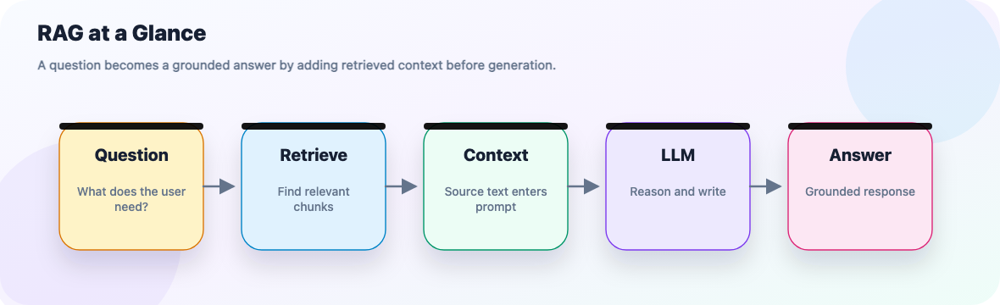

Without RAG, the model answers from training-time recall. With RAG, the model receives fresh context inside the prompt and can answer from that evidence.

**Tiny example**

Question:

```text
What is our refund window?
```

Retrieved context:

```text
Refunds are available within 14 days of purchase for self-serve plans.
Enterprise contracts may define a custom refund period.
```

Prompt instruction:

```text
Answer using only the context. If the context is insufficient, say you do not know.
```

Answer:

```text
The refund window is 14 days for self-serve plans. Enterprise contracts may have a custom refund period.
```

That is the whole shape. Everything else in RAG is about making each step more reliable.

## The RAG Pipeline

RAG has two halves:

- **Indexing** happens offline when documents are added or changed.
- **Querying** happens online for every user question.

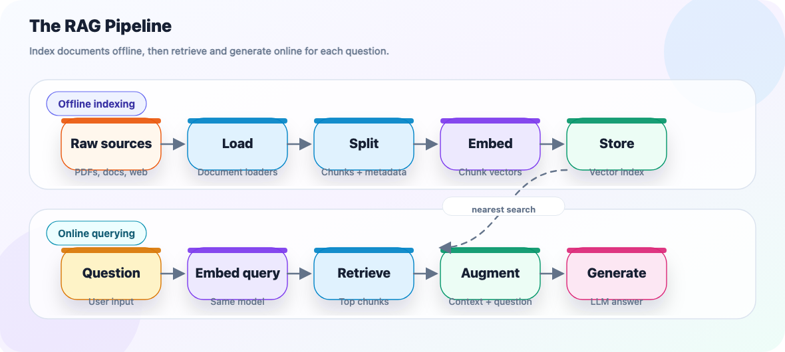

Step by step:

| Step | What happens | Common mistake |
| --- | --- | --- |
| Load | Convert source files into `Document` objects | Losing source/page metadata |
| Split | Break long documents into retrievable chunks | Chunks too large, too small, or no overlap |
| Embed | Convert each chunk into a vector | Changing embedding model without re-indexing |
| Store | Save vectors, text, and metadata | Using an in-memory store for data that must persist |
| Retrieve | Find chunks close to the query vector | Returning too few, too many, or duplicate chunks |
| Augment | Insert retrieved chunks into the prompt | Formatting context so the model cannot separate sources |
| Generate | Ask the LLM to answer from context | Forgetting the "say you do not know" instruction |

**Checkpoint**

If you can explain why indexing is not repeated on every question, you understand the pipeline. The corpus is embedded once; each question is embedded once and compared to the stored vectors.

## Types of RAG

Start with naive RAG. Move to advanced patterns only after you can show what is failing.

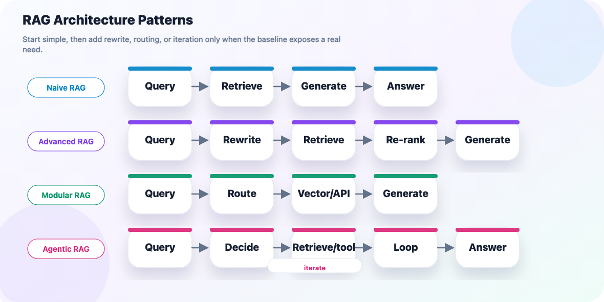

| Type | What it adds | Use it when | Production adoption | Cost |
| --- | --- | --- | --- | --- |
| Naive RAG | Retrieve top-`k`, then generate | You need a baseline; see the [Basic RAG tutorial](Basic_RAG.md) | Very common as the starting architecture; often enough for prototypes and smaller production systems | Lowest |
| Advanced RAG | Query rewrite, re-rank, or compression | The right chunks are often missed or buried; see the [Advanced RAG tutorial](Advanced_RAG.md) | Very common in production; hybrid retrieval, reranking, chunking, vector databases, and evaluation are standard reliability upgrades | Medium |
| Modular RAG | Routing across retrievers/tools | Knowledge lives in multiple source types | Common in enterprise production systems where apps combine docs, SQL/API data, tools, and permissions | Medium/high |
| Corrective RAG | Relevance grading plus fallback | Your index can be incomplete or stale | Specialized but practical; usually appears as production guardrails, fallback search, or retrieval quality checks rather than always by the CRAG name | Medium/high |
| Self-RAG | Decide whether retrieval is needed, then critique evidence | Some questions need retrieval and others do not | Emerging/specialized; more often implemented as evaluation, guardrails, or agentic review than as a standalone architecture | High |
| HyDE | Generate a hypothetical answer, then embed that | User questions are short or vague | Useful niche technique; often folded into broader query reformulation or retrieval optimization work | Medium |
| Graph RAG | Retrieve through entities and relationships | Multi-hop relationship questions are common | Growing but domain-specific; strongest signal in knowledge-graph-heavy enterprise, research, compliance, and connected-data systems | High build cost |
| Agentic RAG | Iterative retrieve/evaluate loop | The system must decide what to search next | Rapidly growing for multi-step workflows; useful when retrieval must be planned, repeated, or combined with tools | Highest |

**How to choose**

- If you are learning or prototyping, choose **naive RAG**.
- If retrieved chunks are relevant but repetitive, try **MMR** or re-ranking.
- If the correct source varies by question, use **modular RAG**.
- If the answer requires multiple steps, use **agentic RAG** with an iteration cap.
- If the domain is relationship-heavy, consider **Graph RAG**.

## Vectors and Embeddings

Embeddings are the search engine inside RAG. They let you compare meaning mathematically.

### What is a vector embedding

An embedding model maps text to a fixed-length list of numbers:

```text
"refund policy" -> [0.12, -0.03, 0.88, ...]
```

Texts with similar meaning should land near each other in vector space. Real embeddings have hundreds or thousands of dimensions, but a two-dimensional picture is useful for intuition:

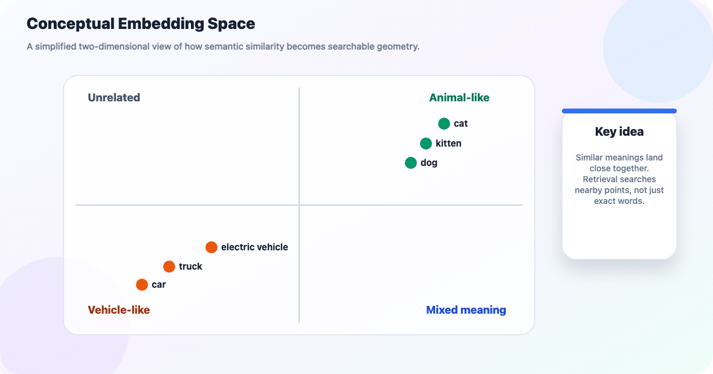

The exact axes are not real. The lesson is real: similar meanings cluster.

**RAG intuition**

When a user asks "How do refunds work?", you do not need exact keyword overlap. A good embedding model can retrieve chunks containing "returns", "cancellation", or "money back" because those concepts are nearby in embedding space.

### Similarity metrics

Retrieval is nearest-neighbor search:

1. Embed the query.
2. Compare it to stored chunk vectors.
3. Return the nearest chunks.

| Metric | What it measures | Best mental model | Direction |
| --- | --- | --- | --- |
| Cosine similarity | Angle between vectors | Same meaning points in same direction | Higher is better |
| Dot product | Element-wise alignment | Fast cosine-like score when vectors are normalized | Higher is better |
| Euclidean distance | Straight-line distance | Physical distance between points | Lower is better |

Most RAG systems default to cosine similarity or dot product. The practical rule: use the metric your vector store expects, and do not mix vectors from different embedding models in the same index.

Small toy example:

```python
import numpy as np

def cosine_similarity(a: np.ndarray, b: np.ndarray) -> float:
    return float(np.dot(a, b) / (np.linalg.norm(a) * np.linalg.norm(b)))

cat = np.array([0.9, 0.1, 0.4, 0.2])
kitten = np.array([0.85, 0.15, 0.35, 0.25])
car = np.array([0.1, 0.9, 0.2, 0.8])

print(cosine_similarity(cat, kitten))  # high: close in meaning
print(cosine_similarity(cat, car))     # lower: less related
```

### Dense vs. sparse embeddings

Dense and sparse search solve different retrieval problems:

| Search style | Good at | Weak at | Example |
| --- | --- | --- | --- |
| Dense embeddings | Meaning, synonyms, paraphrases | Exact IDs, rare names, codes | "car" finds "automobile" |
| Sparse search (BM25/TF-IDF) | Exact words, product IDs, error codes | Semantic paraphrase | `ERR_CONN_RESET` finds the exact error |
| Hybrid search | Combining both strengths | More moving parts | Search docs by meaning and exact terms |

Use dense embeddings as the starting point for prose. Add sparse or hybrid search when exact terms matter.

### Dimensionality and truncation

Vector dimensions affect quality, storage, and speed.

| More dimensions | Fewer dimensions |
| --- | --- |
| More capacity for nuance | Less storage |
| More expensive comparisons | Faster retrieval |
| Larger index | Smaller index |

Several modern embedding models, including OpenAI's `text-embedding-3-*` family and Google's `gemini-embedding-001`, support provider-controlled truncation. That means you request a shorter vector with a `dimensions` parameter at embedding time. Do that instead of manually slicing the returned vector, because supported truncation is part of how the model was trained.

## OpenAI Embeddings

OpenAI embedding models, matching the pricing already tracked in [docs/LLM.md - Text Embedding Models](../LLM.md#text-embedding-models):

| Model | Default dimensions | Truncatable via `dimensions` | Max input | Price per 1M tokens |
| --- | --- | --- | --- | --- |
| `text-embedding-3-small` | 1536 | Yes | 8,192 tokens | $0.02 |
| `text-embedding-3-large` | 3072 | Yes | 8,192 tokens | $0.13 |
| `text-embedding-ada-002` legacy | 1536 | No | 8,192 tokens | $0.10 |

Basic use:

```python
from langchain_openai import OpenAIEmbeddings

embeddings = OpenAIEmbeddings(model="text-embedding-3-small")

query_vector = embeddings.embed_query("What is LCEL?")
chunk_vectors = embeddings.embed_documents([c.page_content for c in chunks])
```

Storage-conscious use:

```python
from langchain_openai import OpenAIEmbeddings

embeddings = OpenAIEmbeddings(
    model="text-embedding-3-large",
    dimensions=1024,
)
```

Use `embed_documents()` for a corpus. It batches many chunks at once and is the right choice when indexing. Use `embed_query()` for one incoming user question.

## Free and Cheap Embedding Models

This repo's canonical, kept-current comparison lives in [docs/LLM.md - Text Embedding Models](../LLM.md#text-embedding-models). For hands-on RAG learning, these are practical starting points:

| Model | Provider | Cost | Dimensions | Good for |
| --- | --- | --- | --- | --- |
| `sentence-transformers/all-MiniLM-L6-v2` | HuggingFace local | Free | 384 | Small, fast local demos |
| `sentence-transformers/all-mpnet-base-v2` | HuggingFace local | Free | 768 | Better local quality when speed matters less |
| `multi-qa-mpnet-base-cos-v1` | HuggingFace local | Free | 768 | Question-answer retrieval |
| `BAAI/bge-small-en-v1.5` | HuggingFace local | Free | 384 | Strong small local retrieval |
| `gemini-embedding-001` | Google API | Free tier | 3072 configurable | API-based high-dimensional embeddings |

Local embeddings have three nice learning properties:

- No per-token embedding cost.
- No rate limits after the model is downloaded.
- No document text leaves your machine.

The tradeoff is that local models can be slower on CPU for large corpora and may have a lower quality ceiling than top proprietary embedding APIs.

```python
from langchain_huggingface import HuggingFaceEmbeddings

embeddings = HuggingFaceEmbeddings(
    model_name="sentence-transformers/all-MiniLM-L6-v2"
)

vector = embeddings.embed_query("What is LCEL?")
```

Embedding-model rankings shift as new open models are released. For broader comparison, check the [MTEB leaderboard](https://huggingface.co/spaces/mteb/leaderboard), then validate promising models against your own documents. A leaderboard score is a clue, not a guarantee.

## Vector Stores

A vector store saves three things together:

1. The chunk text.
2. The chunk metadata.
3. The embedding vector.

Then it answers: "Which stored vectors are nearest to this query vector?"

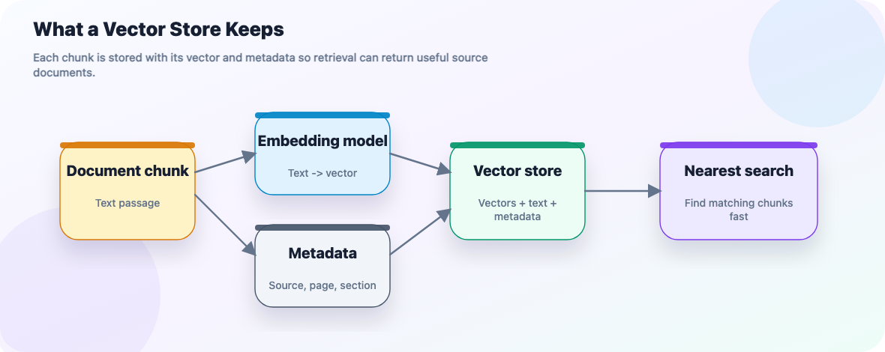

For learning, `InMemoryVectorStore` is enough:

```python
from langchain_core.vectorstores import InMemoryVectorStore
from langchain_text_splitters import RecursiveCharacterTextSplitter

from context_engineering.loaders import load_pdf

documents = load_pdf(pdf_path)

chunks = RecursiveCharacterTextSplitter(
    chunk_size=500,
    chunk_overlap=50,
).split_documents(documents)

vector_store = InMemoryVectorStore(embeddings)
vector_store.add_documents(chunks)
```

For production, use a persistent store such as Chroma, FAISS, Pinecone, or Postgres with pgvector. The LangChain interface stays similar, so the rest of your chain does not need to change much.

**Rule of thumb**

Use in-memory stores for examples and tests. Use persistent stores when the index must survive process restarts.

## Retrievers

A retriever is the chain-friendly wrapper around search. It accepts a question and returns `Document` objects.

```python
retriever = vector_store.as_retriever(search_kwargs={"k": 4})

docs = retriever.invoke("What is LCEL?")
```

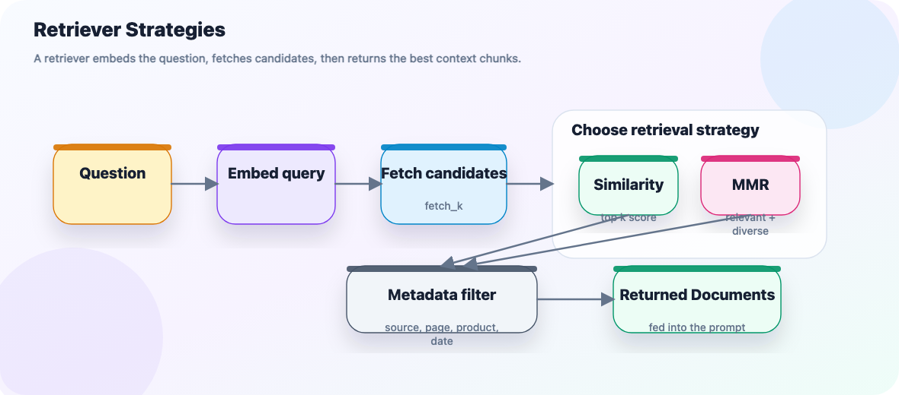

### Similarity search

Similarity search returns the `k` chunks closest to the query embedding.

Use it first because it is simple, fast, and easy to debug:

```python
retriever = vector_store.as_retriever(
    search_type="similarity",
    search_kwargs={"k": 4},
)
```

Debugging tip: print the returned documents before sending them to the LLM.

### Maximal Marginal Relevance (MMR)

Similarity search can return four chunks that all say almost the same thing. MMR tries to balance:

- relevance to the query
- diversity across selected chunks

```python
retriever = vector_store.as_retriever(
    search_type="mmr",
    search_kwargs={
        "k": 4,
        "fetch_k": 20,
        "lambda_mult": 0.5,
    },
)
```

How to read those settings:

| Setting | Meaning |
| --- | --- |
| `fetch_k` | Pull this many candidates first |
| `k` | Return this many final chunks |
| `lambda_mult` | Closer to `1.0` favors relevance; closer to `0.0` favors diversity |

Use MMR when repeated chunks crowd out other useful evidence.

### Metadata filtering

Metadata filtering restricts search before or during retrieval. It is useful when the question already tells you the source, product, date range, page, team, or document type.

Because [document loaders](../Context_Engineering.md#document-loaders) attach `metadata` and [splitting carries metadata forward](../Context_Engineering.md#splitting-pdfs-and-other-documents), you can filter on fields such as `source`:

```python
retriever = vector_store.as_retriever(
    search_kwargs={
        "k": 4,
        "filter": lambda doc: doc.metadata.get("source") == "handbook.pdf",
    },
)
```

The exact filter syntax varies by vector store. Some stores accept callables; hosted stores often use query dictionaries.

## Building a RAG Chain with LCEL

The basic LCEL chain is:

```text
question -> retriever -> format documents -> prompt -> model -> string output
```

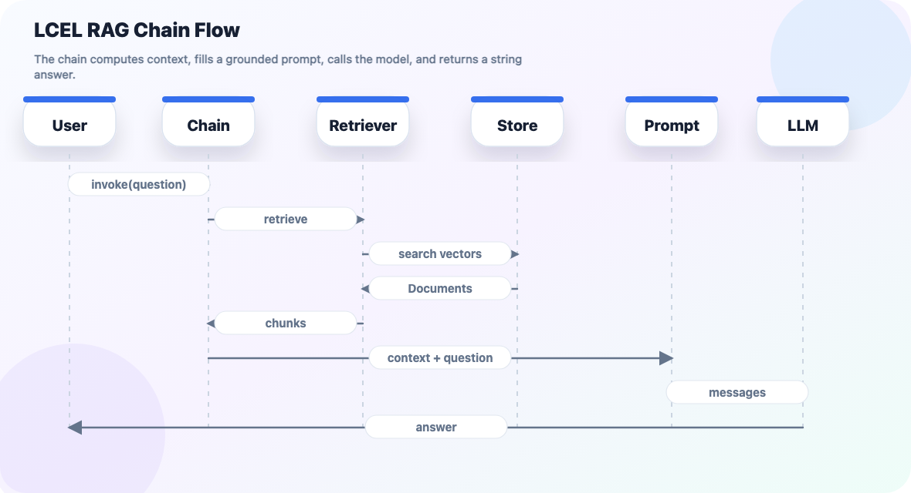

Runnable shape:

```python
from langchain_core.documents import Document
from langchain_core.output_parsers import StrOutputParser
from langchain_core.prompts import ChatPromptTemplate
from langchain_core.runnables import RunnablePassthrough

def format_docs(docs: list[Document]) -> str:
    return "\n\n".join(doc.page_content for doc in docs)

prompt = ChatPromptTemplate.from_template(
    "Answer the question using only the context below. "
    "If the context does not contain the answer, say you do not know.\n\n"
    "Context:\n{context}\n\nQuestion: {question}"
)

rag_chain = (
    {"context": retriever | format_docs, "question": RunnablePassthrough()}
    | prompt
    | model
    | StrOutputParser()
)

answer = rag_chain.invoke("What is LCEL?")
```

Why `RunnablePassthrough()` matters: it keeps the user's original question while the retriever computes a new `context` value. This is the same pattern shown with a stub retriever in [runnable_passthrough_context.py](../../src/context_engineering/runnable_passthrough_context.py).

**Prompt lesson**

Grounding is not automatic. You must tell the model how to use the retrieved text:

- answer from context
- say when context is insufficient
- avoid unsupported claims
- cite source metadata when your app needs traceability

## Beyond RAG: Other Context-Engineering Techniques

RAG is one way to put useful information into the context window. It sits beside system prompts, tool results, memory, and compaction.

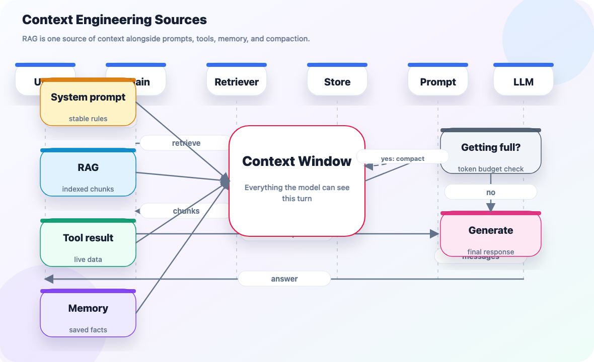

### Static system prompts

A system prompt is the cheapest context injection method. Use it for small, stable instructions that should apply to every request:

- role and behavior
- formatting rules
- safety rules
- a small static policy
- output schema requirements

Do not put large or frequently changing knowledge into the system prompt. Retrieve or inject that instead.

| Put it in the system prompt when... | Retrieve or inject it instead when... |
| --- | --- |
| It is small | It is large |
| It rarely changes | It changes often |
| Every request needs it | Only some requests need it |
| Always including it is cheap | Always including it wastes tokens |

For prompt-injection concerns, see [Prompt_Engineering.md - System Prompts & Injection-Resistant Design](../Prompt_Engineering.md#system-prompts--injection-resistant-design) and [SystemPrompt_Pattern.py](../../src/prompt_engineering/patterns/SystemPrompt_Pattern.py).

### Tool-result injection

RAG retrieves from data indexed in advance. Tool-result injection fetches or computes data at request time.

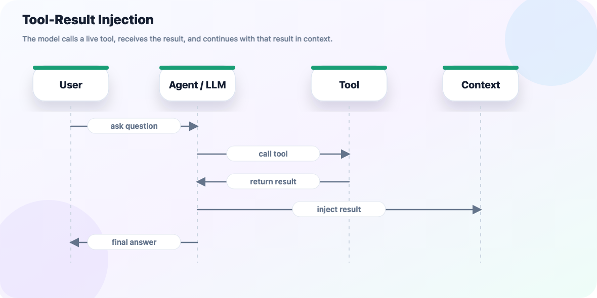

| | RAG | Tool-result injection |
| --- | --- | --- |
| Data timing | Pre-indexed | Fetched live |
| Freshness | As fresh as last index | Current at call time |
| Best for | Known corpora | APIs, web, code, databases |
| Main risk | Stale or incomplete index | Unbounded tool output |

This is the mechanism behind the [ReAct pattern](../Prompt_Engineering.md#react-reasoning--acting-pattern). See [calc_tool_agent.py](../../src/agent-tools/calc_tool_agent.py) and [web_search_tool_agent.py](../../src/agent-tools/web_search_tool_agent.py) for runnable examples.

Tool results consume context like retrieved chunks. Summarize or truncate large tool output before injecting it.

### Memory systems

Memory is retrieval over information the system saved earlier.

Two scopes matter:

| Memory scope | Meaning | Example |
| --- | --- | --- |
| Short-term memory | Keeps earlier turns in one thread | "What did I ask two messages ago?" |
| Long-term memory | Recalls facts across threads/sessions | "What is my preferred language?" |

Short-term memory is covered in [Prompt_Engineering.md - Conversation Memory Patterns](../Prompt_Engineering.md#conversation-memory-patterns), with runnable examples in [state_memory.py](../../src/context_engineering/state_memory.py) and [Memory_Pattern.py](../../src/context_engineering/Memory_Pattern.py).

Long-term memory needs storage outside a single thread. LangGraph's `Store` interface is one way to do this.

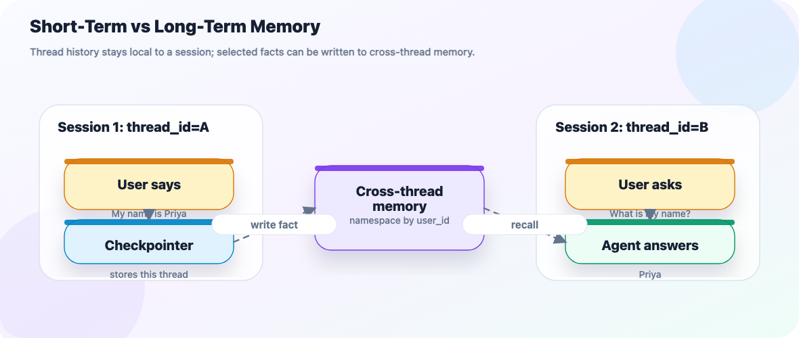

```python
from langgraph.store.memory import InMemoryStore

store = InMemoryStore()

store.put(
    ("user_123", "memories"),
    "pref_1",
    {"food_preference": "pizza"},
)

item = store.get(("user_123", "memories"), "pref_1")
items = store.search(("user_123", "memories"), limit=10)
```

Semantic memory looks even more like RAG: memories are embedded on write, then recalled by natural-language search.

```python
from langchain.embeddings import init_embeddings
from langgraph.store.memory import InMemoryStore

store = InMemoryStore(
    index={
        "embed": init_embeddings("openai:text-embedding-3-small"),
        "dims": 1536,
        "fields": ["food_preference", "$"],
    }
)

results = store.search(
    ("user_123", "memories"),
    query="What does the user like to eat?",
    limit=3,
)
```

Memory guardrails:

- Save deliberate facts, not every message.
- Do not store secrets or credentials.
- Keep memory scoped by user/account/workspace.
- Periodically prune stale or low-value memories.

### Compaction and context editing

Every context source consumes tokens. Compaction decides what to do when the context window gets crowded.

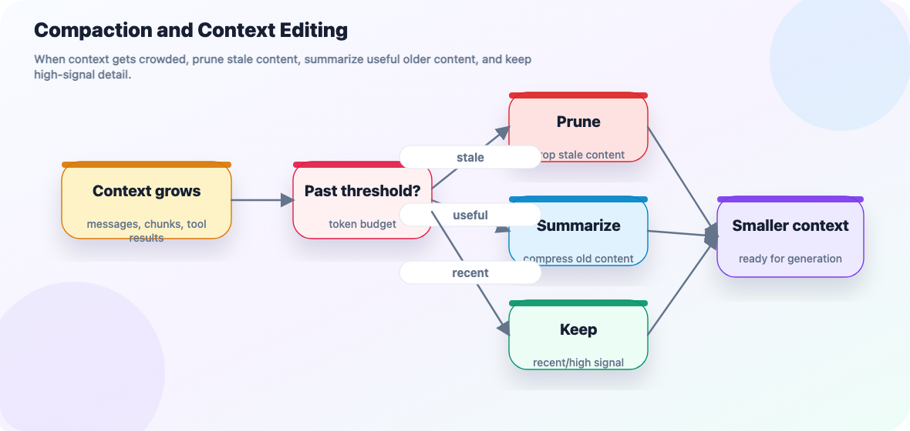

| Strategy | Meaning | Tradeoff |
| --- | --- | --- |
| Pruning | Drop old or irrelevant content | Cheap, but details are gone |
| Summarization | Replace old content with a compact summary | Keeps gist, may lose exact details |
| Selective retention | Keep recent or high-signal items verbatim | Better accuracy, uses more tokens |

This generalizes [Window memory and Summary memory](../Prompt_Engineering.md#conversation-memory-patterns). The [`SummarizationMiddleware` example in `Memory_Pattern.py`](../../src/context_engineering/Memory_Pattern.py) is a runnable version of the summarize path.

### Summary: five techniques, one context window

| Technique | Source of content | Freshness | Best for |
| --- | --- | --- | --- |
| Static system prompt | Written once by you | Changes only when edited | Stable rules |
| RAG | Pre-indexed corpus | Last index time | Private/current documents |
| Tool-result injection | Live tool call | Current at call time | APIs, web, computation |
| Memory systems | Saved user/session facts | Last write time | Personalization across time |
| Compaction/editing | Existing context | N/A | Staying within token budget |

## RAG vs. Fine-Tuning

RAG and fine-tuning are often confused because both can improve an application's answers. They solve different problems.

| Question | Prefer RAG | Prefer fine-tuning |
| --- | --- | --- |
| Do I need current/private facts? | Yes | No |
| Does data change often? | Yes | No |
| Do I need citations or traceability? | Yes | No |
| Do I need different tone, format, or behavior? | No | Yes |
| Is the update cheap? | Re-index changed docs | Re-train model |

Use RAG for knowledge. Use fine-tuning for behavior. Use both when the system needs a custom style and access to changing external facts.

## Evaluating RAG Quality

Debug RAG in two passes.

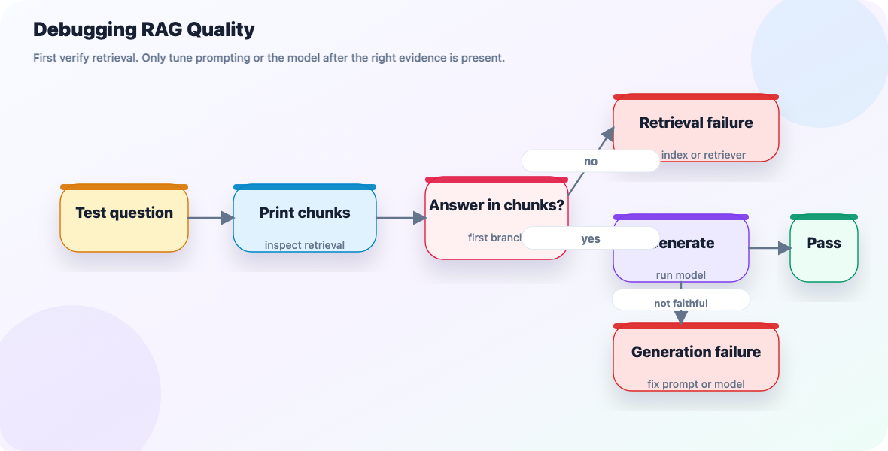

**Retrieval failure**

The right chunk was never fetched.

Try:

- tune `chunk_size` and `chunk_overlap`
- increase `k`
- use MMR
- add metadata filters
- try hybrid search
- test a better embedding model

See [Chunking: Strategy, Size, and Overlap](../Context_Engineering.md#chunking-strategy-size-and-overlap).

**Generation failure**

The right chunk was fetched, but the model ignored, contradicted, or over-extended it.

Try:

- make the prompt stricter
- reduce irrelevant chunks
- ask for citations
- tell the model to say "I do not know"
- use a stronger model

For reasoning patterns, see [Chain-of-Thought](../Prompt_Engineering.md#chain-of-thought-cot-pattern).

## Common Pitfalls

| Pitfall | Why it hurts | Fix |
| --- | --- | --- |
| Skipping `chunk_overlap` | Facts split across boundaries are hard to retrieve | Add overlap; see [Why `chunk_overlap` matters](../Context_Engineering.md#why-chunk_overlap-matters) |
| Mismatched embedding models | Query vectors and document vectors are not comparable | Re-embed whenever the embedding model changes |
| `k` too small | Correct chunk may be excluded | Increase `k` or improve chunking |
| `k` too large | Irrelevant chunks dilute the prompt | Lower `k`, use MMR, or compress |
| No "I do not know" instruction | Model fills gaps from memory | Add explicit grounding rules |
| Stale index | Changed source data is not reflected | Re-index changed documents |
| Raw tool output injection | Huge output consumes context | Summarize or truncate tool results |
| Unbounded long-term memory | Irrelevant memories out-compete useful ones | Store deliberate facts and prune |
| Over-aggressive compaction | Summaries drop exact names/numbers | Keep recent/high-signal details verbatim |

## Study Checklist

You are comfortable with RAG when you can answer these:

- What happens during indexing, and what happens during querying?
- Why must query and document embeddings use the same model?
- How do `k`, `fetch_k`, and MMR affect retrieved context?
- How do you tell whether a bad answer is a retrieval failure or generation failure?
- When would you use a system prompt, RAG, a tool call, memory, or compaction?
- Why is RAG usually better than fine-tuning for changing private knowledge?

The fastest way to learn is to build naive RAG, print the retrieved chunks, and tune only one variable at a time.
